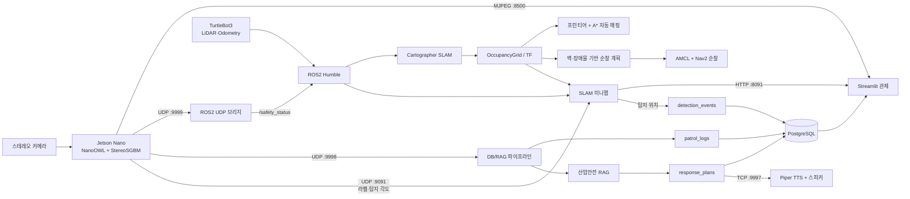

# han_2026 구현 기술 및 핵심 코드 요약

> 개발보고서를 직접 수정할 때 참고하기 위한 코드 기반 요약 문서이다.  
> 작성 기준: `han_2026` 저장소에 실제로 존재하는 소스 코드, 설정 파일, 실행 스크립트 및 자체 테스트.
> 최종 갱신: 2026-09-06 (`with-no-helmet` 브랜치, 커밋 `2f7b26e`까지 반영).
>
> 2026-09-06 갱신 요약: 커밋 `82a21cb`(RAG 연동 중 끊김 수정), `bb98904`, `c479453`(TTS 프로토콜 전면 개편), `74aa606`(Nav2 디지털 트윈 스택 완결 및 RAG/TTS 실물 배포 통합), `2f7b26e`(안전모 미착용 판정 로직 재구성)의 변경 사항을 반영하였다. 특히 `74aa606`의 커밋명은 "가제보 3D 추가버전"이나, 실제 diff는 새로운 3D 에셋 추가가 아니라 **Gazebo 디지털 트윈의 Nav2 자율주행 스택 버그 수정과 실물 배포 스크립트에 RAG·TTS 자동 기동을 통합한 것**이므로 본 문서에서는 이를 정확히 구분하여 서술한다.

## 1. 프로젝트 개요

본 프로젝트는 TurtleBot3 기반 이동 로봇이 스마트 팩토리 내부를 자율 매핑·순찰하면서 작업자 안전모 미착용, 화재, 차량·중장비 접근 등의 위험 상황을 탐지하고, 탐지 위치와 위험도를 관제 대시보드에 표시한 뒤 산업안전 지침 기반 대응안과 현장 음성 경보를 제공하는 통합 안전 순찰 시스템이다.

주요 구현 범위는 다음과 같다.

- ROS2·Cartographer 기반 실내 SLAM 및 지도 저장
- 프런티어 탐색과 A* 경로를 결합한 감독형 자동 매핑
- 저장 지도에서 벽·장애물·미탐사 영역을 판별하여 순찰 지점 자동 생성
- AMCL·Nav2 기반 다중 웨이포인트 순찰과 위치 이동 제어
- Jetson Nano의 NanoOWL 객체 탐지 및 StereoSGBM 거리 추정
- 지도·TF·LiDAR와 AI 탐지를 결합한 객체 위치 표시 및 추적
- PostgreSQL 기반 순찰 로그·탐지 이벤트·대응안 저장
- 산업안전 지식베이스를 이용한 RAG 대응안 생성
- Streamlit 기반 영상·미니맵·위험 로그·순찰 제어 통합 관제
- Piper TTS 기반 현장 음성 경보
- Gazebo 디지털 트윈 및 하드웨어 없이 실행 가능한 회귀 테스트

## 2. 전체 시스템 구성



### 데이터 처리 순서

1. Jetson Nano가 스테레오 영상을 수집한다.
2. NanoOWL이 `person`, `safety helmet`, `fire`, `vehicle` 네 클래스를 탐지한다. 안전모는 사람 머리 영역에서 4초 연속 확인되지 않을 때만 최종 출력이 `person with no helmet`으로 바뀌며, `safety helmet` 자체는 하류로 전송되지 않는다([5.2](#52-nanoowl-객체-탐지와-안전모-판정-2026-09-06-개편) 참고).
3. 탐지된 바운딩 박스 내부의 시차를 StereoSGBM으로 계산하고 `Z = f × B / disparity` 식으로 거리를 구한다.
4. 탐지 결과는 용도별 UDP 포트로 ROS2, DB/RAG 파이프라인, 미니맵에 동시에 전송된다.
5. ROS2 브리지는 UDP JSON을 검증한 후 `/safety_status` 토픽으로 발행한다.
6. SLAM 지도와 TF를 이용해 로봇 위치를 추적하고, 탐지 각도 또는 거리·바운딩 박스를 지도 좌표로 변환한다.
7. 순찰 로그와 지도 탐지 이벤트를 PostgreSQL에 저장한다.
8. 위험 이벤트에는 산업안전 지식베이스를 검색하여 대응안을 생성하고 `response_plans`에 저장한다.
9. Streamlit 대시보드가 영상, 미니맵, 로봇 상태, 위험 로그, 대응안을 표시한다.
10. 화재 등 긴급 위험 이벤트는 감지 즉시 LLM/DB 저장을 기다리지 않고 현장 방송 전용 짧은 문장으로 자동 반복 방송되며, 관리자가 대시보드에서 상세 대응안의 음성 안내를 누르거나 파이프라인을 `--tts`로 실행하면 같은 방식으로 문장이 우선순위·유효시간을 포함한 TCP 메시지로 Jetson에 전달되어 Piper TTS로 재생되고 재생 큐 등록 결과가 ACK로 되돌아온다.

## 3. 적용 기술 스택

| 구분 | 적용 기술 | 사용 목적 |
|---|---|---|
| 로봇 플랫폼 | TurtleBot3 Burger, LiDAR, Stereo Camera | 이동, 장애물 인식, 영상·거리 데이터 수집 |
| 엣지 컴퓨팅 | Jetson Nano, NVIDIA Jetson용 Docker 환경 | NanoOWL 추론 및 스테레오 영상 처리 |
| 운영체제 | Ubuntu 22.04 계열 | ROS2 및 Jetson 실행 환경 |
| 로봇 미들웨어 | ROS2 Humble, DDS, `rclpy` | 노드·토픽·서비스·액션 통신 |
| 자율주행 | Cartographer, AMCL, Nav2 | SLAM, 위치 추정, 경로 계획 및 목표 주행 |
| 시뮬레이션 | Gazebo, RViz2, URDF/SDF | 디지털 트윈 및 시각 검증 |
| 지도 처리 | OccupancyGrid, NumPy, OpenCV | 자유·점유·미탐사 셀 판별, 거리 변환, 구역 분할 |
| 자동 매핑 | BFS 프런티어 탐색, 장애물 팽창, A*, 방문 기억 | 미탐사 구역 탐색과 안전 경로 생성 |
| 순찰 경로 | Distance Transform, 연결 성분, k-means, Dijkstra, 최근접 이웃, 2-opt | 벽을 통과하지 않는 순찰 지점·순서 생성 |
| 객체 탐지 | NanoOWL, TensorRT/PyTorch 기반 Jetson 환경 | 개방형 텍스트 프롬프트 기반 위험 객체 탐지 |
| 거리 추정 | OpenCV StereoSGBM, 스테레오 캘리브레이션 | 탐지 객체 거리 계산 |
| 영상 전송 | MJPEG HTTP 서버 | 관제 화면 실시간 영상 제공 |
| 데이터베이스 | PostgreSQL, `psycopg2` | 순찰 로그, 탐지 좌표, 대응안, 지식베이스 저장 |
| RAG | BGE-M3, pgvector, 키워드 검색, 선택적 vLLM | 산업안전 근거 검색 및 대응안 생성 |
| 관제 UI | Streamlit, Pandas, Flask, HTML/iframe | 영상·미니맵·로그·제어 통합 |
| 음성 출력 | Piper TTS, ALSA `aplay`/`amixer`, PulseAudio(우회 경로) | 현장 한국어 음성 경보 및 스피커 볼륨 원격 제어 |
| 통신 | UDP, TCP, HTTP, ROS2 Topic/Service/Action | 장치·프로세스 간 분산 연동 |
| 검증 | Python 자체 테스트, pytest 연동, AST 구문 검사 | 알고리즘 및 통합 계약 회귀 검증 |

## 4. ROS2 자율주행 및 자동 매핑

### 4.1 주요 코드

- [`auto_mapper.py`](<ROS2_자율주행_및_연동(이다은)/smart_factory_sim/auto_mapper.py>): 감독형 자동 매핑 주행
- [`patrol_planner.py`](<ROS2_자율주행_및_연동(이다은)/smart_factory_sim/patrol_planner.py>): 저장 지도 기반 순찰 경로 생성
- [`patrol_node.py`](<ROS2_자율주행_및_연동(이다은)/smart_factory_sim/patrol_node.py>): Nav2 목표 순차 실행 및 관제 명령 처리
- [`stall_monitor.py`](<ROS2_자율주행_및_연동(이다은)/smart_factory_sim/stall_monitor.py>): LiDAR에 보이지 않는 낮은 장애물·주행 정체 감지
- [`event_detector.py`](<ROS2_자율주행_및_연동(이다은)/smart_factory_sim/event_detector.py>): AI 탐지를 지도 좌표로 투영하고 RViz 이벤트 마커 발행
- [`real_cartographer.launch.py`](<ROS2_자율주행_및_연동(이다은)/launch/real_cartographer.launch.py>): 실물 Cartographer 실행
- [`real_navigation.launch.py`](<ROS2_자율주행_및_연동(이다은)/launch/real_navigation.launch.py>): 저장 지도, AMCL, Nav2, 순찰 노드 실행
- [`digital_twin.launch.py`](<ROS2_자율주행_및_연동(이다은)/launch/digital_twin.launch.py>): Gazebo 디지털 트윈(공장 랙 6개 배치) 통합 실행
- [`simulation.launch.py`](<ROS2_자율주행_및_연동(이다은)/launch/simulation.launch.py>): Gazebo 장애물 시뮬레이션(20×20m, 장애물 11개) 통합 실행
- [`run_real_autonomous_mapping.sh`](<ROS2_자율주행_및_연동(이다은)/run_real_autonomous_mapping.sh>): 실물 자동 매핑·지도 저장 실행기
- [`run_real_dashboard_stack.sh`](<ROS2_자율주행_및_연동(이다은)/run_real_dashboard_stack.sh>): 실물 Nav2·미니맵·대시보드·RAG·TTS 통합 실행기

### 4.2 자동 매핑 알고리즘

`auto_mapper.py`는 Nav2 없이 `/scan`, `/map`, TF를 결합하는 감독형 프런티어 탐색기이다.

핵심 처리 과정은 다음과 같다.

1. OccupancyGrid에서 점유도 50 이상을 벽·장애물로 판정한다.
2. 로봇 주변 후보 방향에 부채꼴 레이를 발사하여 미탐사 셀 수를 계산한다.
3. 레이가 벽을 만나면 그 뒤의 미탐사 셀은 점수에 포함하지 않는다. 따라서 벽 뒤 공간을 향해 계속 주행하는 문제를 방지한다.
4. 0.5m 단위 방문 기억에 진입 횟수를 저장하고, 이미 여러 번 통과한 방향에 벌점을 준다.
5. 현재 자유공간과 연결된 프런티어 후보를 BFS로 찾는다.
6. 장애물을 로봇 반경과 안전 여유만큼 팽창한 뒤 A*로 프런티어까지의 실제 경로를 생성한다.
7. 직선 구간이 안전 셀만 지나는지 확인해 불필요한 중간점을 줄이고 근거리 웨이포인트를 따라간다.
8. 작은 방향 오차에서는 원호 주행을 하고 큰 오차만 제자리 회전한다.
9. 회전 방향을 일정 시간 유지해 벽 앞 좌우 진동을 방지한다.
10. 범퍼, LiDAR 정지 거리, 스캔 타임아웃, 전후방 폐색을 일반 탐색 명령보다 우선 처리한다.

대표 핵심 로직은 다음과 같다.

```python
# 벽 뒤의 미탐사 셀은 탐색 점수에서 제외한다.
if cell is None:
    unknown += 1
elif cell >= OCC_THRESHOLD:
    break
elif cell < 0:
    unknown += 1

# 새로운 공간 선호 점수 = 미탐사 셀 수 - 기존 방문 벌점
score = unknown_count - visit_weight * visit_penalty
```

이 방식은 단순히 좌우 LiDAR 거리만 비교하던 랜덤워크보다 이미 방문한 통로의 반복 주행을 줄이고, 벽을 우회하는 실제 통로 경로를 생성한다.

### 4.3 벽·장애물 기반 순찰 경로 생성

`patrol_planner.py`는 사전에 고정 좌표를 입력하지 않고 현재 OccupancyGrid로부터 순찰 경로를 만든다.

- 미탐사 셀 `-1`은 자유공간에서 제외한다.
- OpenCV `distanceTransform`으로 각 자유 셀에서 가장 가까운 벽까지의 거리를 구한다.
- 기본적으로 벽에서 0.25m 이상 떨어진 셀만 순찰 후보로 사용한다.
- 로봇 시작점과 연결된 자유공간만 남겨 닫힌 방이나 도달 불가능한 공간을 제외한다.
- 자유공간을 k-means로 구역화하고 기본 구역 이름 `A`~`F`를 적용할 수 있다.
- 넓은 구역에는 더 많은 지점을 두되 구역당 최대 지점 수와 지점 간 최소 간격을 제한한다.
- 웨이포인트 간 직선거리가 아니라 지도 위 Dijkstra 측지거리를 계산한다.
- 최근접 이웃으로 초기 순서를 만든 후 2-opt로 순찰 거리를 개선한다.
- 각 지점의 yaw는 다음 지점을 향하도록 설정해 이동 중에도 카메라가 진행 방향을 바라보게 한다.

핵심 설계는 “벽 모양을 따라 점을 임의 배치”하는 것이 아니라 “벽과 충분히 떨어져 있으면서 실제로 도달 가능한 자유공간의 대표점”을 선정하는 것이다.

### 4.4 사각형 전체가 지도로 인식되던 오류 개선

문제 원인은 PGM의 미탐사 회색 값 205가 점유도로 환산되면 약 `0.19608`인데, 지도 저장 시 기본 `free_thresh=0.25`를 사용하면 이 영역이 자유공간으로 다시 읽히는 것이었다. 그 결과 지도 바깥까지 하나의 큰 사각형 방처럼 인식되어 잘못된 순찰 지점이 생성될 수 있었다.

적용한 개선은 다음과 같다.

- 지도 저장 명령을 `map_saver_cli --free 0.196`으로 통일하였다.
- 생성되는 지도 YAML의 `free_thresh`를 `0.196`으로 저장한다.
- `has_suspicious_free_border()`가 네 모서리와 외곽 자유 셀 비율을 검사한다.
- 외곽의 90% 이상이 자유 셀인 의심 지도는 자동 순찰 계획을 거부한다.
- 미니맵과 순찰 플래너가 같은 검사를 사용하여 화면 표시와 실제 이동 명령의 판단이 어긋나지 않도록 했다.

```python
if has_suspicious_free_border(grid):
    return PatrolPlan.failed(
        "지도 바깥 미탐사 영역이 자유 공간으로 읽혀 전체가 사각형으로 잡혔습니다. "
        "지도 YAML의 free_thresh를 0.196으로 고친 뒤 map_server/Nav2를 다시 시작하세요."
    )
```

### 4.5 낮은 장애물과 정체 대응

`stall_monitor.py`는 모터 명령이 존재하지만 위치·엔코더 변화가 충분하지 않은 상태를 감지한다. 문턱이나 케이블 트레이처럼 LiDAR 스캔에 나타나지 않는 장애물은 지도 좌표와 반경을 JSON으로 저장한다.

저장된 낮은 장애물은 다음 실행에서도 사용된다.

- 자동 매핑 방향 점수에 큰 벌점 적용
- 순찰 웨이포인트 후보에서 해당 영역 제거
- Nav2 local/global costmap의 KeepoutFilter 마스크에 반영
- 미니맵에 주황색 금지 지점으로 표시

### 4.6 관제 재실행 시 이전 스택 오탐 개선

`run_real_dashboard_stack.sh`에는 이전 ROS 관제 프로세스가 남았다고 잘못 판단하거나 자식 프로세스가 실제로 남는 문제를 줄이기 위한 처리가 적용되어 있다.

- `ros2 node list --no-daemon --spin-time 2`로 ROS daemon의 오래된 그래프 캐시를 우회한다.
- `EXIT`, `INT`, `TERM`, `HUP` 신호를 모두 종료 트랩에 연결한다.
- Nav2 launch를 독립 프로세스 그룹으로 실행한다.
- 종료 시 정지 속도 명령을 먼저 발행한 뒤 자식 프로세스 그룹 전체에 `INT → TERM → KILL` 순서로 제한시간을 두고 종료한다.
- 그룹 리더 PID만이 아니라 전체 프로세스 그룹의 생존 여부를 확인한다.
- 두 번째 Ctrl+C 입력에는 강제 정리 경로를 제공한다.

```bash
ros2 node list --no-daemon --spin-time 2
trap cleanup EXIT INT TERM HUP
setsid ros2 launch smart_factory_sim real_navigation.launch.py ...
kill -INT -- "-$nav_pid"
```

실제 TurtleBot3·Jetson·ROS 도메인을 모두 연결한 상태에서 반복 종료·재실행 시험까지 완료하였다.

### 4.7 디지털 트윈 Nav2 스택 완결과 실물 배포 RAG·TTS 통합 (2026-09-05)

`digital_twin.launch.py`와 `simulation.launch.py`에는 그동안 각각 다른 노드 구성이 들어 있어, 디지털 트윈(공장 랙 배치)에서는 AMCL이 위치 추정을 시작하지 못하는 문제가 있었다. 원인은 `nav2_params.yaml`의 AMCL·costmap이 `/scan_nav` 토픽을 구독하는데 Gazebo는 `/scan`만 발행하고, 이 둘을 이어주는 `scan_qos_relay` 노드가 `digital_twin.launch.py`에는 누락되어 있었기 때문이다. 같은 이유로 낮은 장애물 Keepout 마스크를 공급하는 `stall_monitor` 노드도 빠져 있었다.

```python
# digital_twin.launch.py: nav2_params.yaml은 /scan_nav를 구독하지만
# Gazebo는 /scan만 발행하므로 relay가 없으면 AMCL이 영원히 시작되지 않는다.
scan_qos_relay = Node(
    package='smart_factory_sim',
    executable='scan_qos_relay',
    parameters=[{'input_topic': '/scan', 'output_topic': '/scan_nav', ...}],
)
stall_monitor = Node(package='smart_factory_sim', executable='stall_monitor', ...)
```

두 launch 파일에 `scan_qos_relay`와 `stall_monitor`를 동일하게 배치하여 디지털 트윈과 장애물 시뮬레이션이 항상 동등한 Nav2 구성을 갖도록 수정하였다. 즉 이 변경은 지도·매핑 알고리즘 자체를 바꾼 것이 아니라 **기존 Gazebo 디지털 트윈에서 자율주행 스택이 실제로 완전히 동작하도록 마무리한 버그 수정**이다.

같은 커밋에서 실물 로봇 배포 스크립트 `run_real_dashboard_stack.sh`에는 RAG 대응안 생성과 Piper TTS 음성 경보를 자동으로 함께 기동하는 기능이 추가되었다.

```bash
ENABLE_RAG="${ENABLE_RAG:-1}"
ENABLE_LLM="${ENABLE_LLM:-1}"
ENABLE_TTS="${ENABLE_TTS:-1}"
if [[ "$ENABLE_RAG" == "1" ]]; then
  rag_args=()
  [[ "$ENABLE_LLM" == "1" ]] && rag_args+=(--use-llm --async-llm)
  [[ "$ENABLE_TTS" == "1" ]] && rag_args+=(--tts)
  (cd "$DASHBOARD_DIR" && exec ./run_pipeline_rag.sh "${rag_args[@]}") >"$RUN_DIR/rag.log" 2>&1 &
  rag_pid=$!
fi
```

종료 트랩(`cleanup`, `force_cleanup`)에도 `rag_pid` 종료 처리가 추가되어 Ctrl+C 한 번으로 Nav2·미니맵·RAG·TTS 프로세스가 함께 정리된다. 또한 워크스페이스 탐색 순서에 `"$REPO_ROOT/.runtime/ros-install/setup.bash"`가 최우선으로 추가되었는데, 이는 Nav2의 C++ YAML 로더가 한글이 포함된 install 경로를 잘못 처리하는 환경을 우회하기 위해 한글이 없는 `.runtime` 하위에 별도로 빌드하는 경로를 지원한 것이다.

이 외에 `event_detector.py`, `mock_event_bridge.py`, `dashboard_link/minimap_renderer.py`에는 Ctrl+C·launch SIGINT로 종료할 때 `rclpy.shutdown()` 이중 호출이나 스레드 경쟁으로 예외가 출력되던 문제를 정리하는 방어 코드가 추가되었다(`rclpy.ok()` 확인 후 `try/except`로 감싸고 spin 스레드를 `join(timeout=2.0)`으로 정리).

## 5. Jetson 비전 및 거리 추정

### 5.1 주요 코드

- [`ai_inference_sender.py`](smart_factory_project/ai_inference_sender.py): 카메라 수집, NanoOWL, StereoSGBM, 영상·UDP 송신
- [`stereo_calibrate.py`](smart_factory_project/stereo_calibrate.py): 스테레오 촬영·캘리브레이션·정렬 검증 CLI
- [`vision_inference_node.py`](smart_factory_project/vision_inference_node.py): UDP를 ROS2 `/safety_status`로 변환
- [`requirements-vision.txt`](smart_factory_project/requirements-vision.txt): 일반 pip 설치 가능 비전 의존성

Jetson 배포용 동일 코드가 [`젯슨 연결용 프로그램(손준영)`](<젯슨 연결용 프로그램(손준영)>) 폴더에도 제공된다.

### 5.2 NanoOWL 객체 탐지와 안전모 판정 (2026-09-06 개편)

#### 5.2.1 기존 방식과 한계

기존에는 NanoOWL에 부정문 프롬프트를 직접 물었다.

```python
text_prompt = [
    "person with no helmet",
    "person",
    "fire",
    "vehicle",
]
```

개방형 텍스트 탐지 특성상 "person"과 "person with no helmet"이 같은 작업자에게 동시에 반응하는 문제가 있었다. 두 프롬프트가 "person"이라는 토큰을 공유하고 탐지 임계값이 낮아, 안전모를 제대로 착용한 작업자에게도 위반 쪽 쿼리가 함께 걸렸다. 초기에는 프롬프트 순서(위반이 0번)로 우선순위를 고정해 항상 위반 쪽이 남았고, 이후에는 점수 기반 중복 제거에 `HELMET_SAFETY_MARGIN`(위반 쪽 가산점)을 더하는 방식으로 완화했었다. 그러나 근본 원인은 순서나 가중치가 아니라 **"안전모가 없다"는 부정 상태를 개방형 검출기에 한 번의 프레임으로 직접 판단시키는 구조 자체**였다. 카메라 각도나 순간적인 가림으로 안전모가 한 프레임에서만 안 보여도 즉시 위반으로 잡히는 등, 판정이 프레임 단위로 흔들리는 문제가 남아 있었다.

#### 5.2.2 개편된 방식 — 긍정 탐지 + 머리 영역 확인 + 4초 지속 판정

`smart_factory_project/ai_inference_sender.py`(및 Jetson 배포 동일 사본)는 부정문 프롬프트를 없애고, NanoOWL에는 두 가지 긍정 객체만 묻도록 바꾸었다.

```python
text_prompt = ["person", "safety helmet", "fire", "vehicle"]
```

`person`과 `safety helmet` 박스가 겹치는 것은 정상 상태(안전모를 쓴 사람)이므로 더 이상 중복 제거 대상이 아니다. 대신 다음 두 조건을 모두 만족해야 "안전모 미착용"으로 확정한다.

1. **머리 영역 검사** — `helmet_in_head_region()`이 안전모 박스의 중심점이 사람 박스 상단 40%(`PPE_HEAD_REGION_RATIO`, 좌우 8% 여유 포함) 안에 들어오는지 확인한다.
2. **4초 지속 판정** — `HelmetComplianceTracker`가 사람 박스를 프레임 간 IoU(≥`PPE_TRACK_IOU_THRESHOLD`, 기본 0.20)로 추적하면서, 머리 영역에서 안전모가 관측되지 않은 시간을 누적한다. 이 시간이 `PPE_NO_HELMET_CONFIRM_SEC`(기본 4.0초) 이상 지속될 때만 최종 라벨을 `person with no helmet`으로 바꾼다. 안전모가 다시 보이면 지연 없이 즉시 `person`으로 복귀한다.

```python
# 4초 연속 미확인일 때만 위반으로 확정하고,
# 안전모가 다시 보이면 즉시 정상으로 되돌린다.
if has_helmet:
    track["without_helmet_since"] = None
    violations.append(False)
    continue
if track["without_helmet_since"] is None:
    track["without_helmet_since"] = now
violations.append(now - track["without_helmet_since"] >= self.confirm_sec)
```

트랙은 `PPE_TRACK_STALE_SEC`(기본 1.5초) 동안 매칭되지 않으면 삭제되어, 화면 밖으로 나갔다 들어온 사람은 새 트랙으로 다시 시작한다. 위반 판정은 4초의 확인 지연을 두어 보수적으로(놓치는 대신 신중하게) 처리하고, 정상 복귀는 지연 없이 즉시 처리하는 비대칭 설계로, 순간적인 오탐을 줄이면서도 실제 미착용은 늦게라도 반드시 잡아낸다.

`safety helmet` 박스 자체는 내부 판정에만 쓰이고 UDP·화면·다운스트림 어디로도 전송되지 않는다. `apply_helmet_compliance()`가 최종적으로 내보내는 라벨은 기존과 동일한 4종 계약을 유지한다.

```python
OUTPUT_LABELS = ["person with no helmet", "person", "fire", "vehicle"]
```

이 덕분에 `common/schema.py`의 위험도 판정, 대시보드, 미니맵, RAG 파이프라인 등 하류 구성요소는 이번 변경으로 전혀 수정할 필요가 없었다 — 입력 탐지 방식만 바뀌고 출력 계약은 그대로 유지된 구조 변경이다.

`suppress_overlapping_detections()`는 역할이 단순해졌다. 이제는 **같은 클래스** 안에서 겹치는 박스만 신뢰도 점수로 정리하며, `person`과 `safety helmet`처럼 서로 다른 클래스는 겹쳐도 그대로 둔다(원래 겹치는 것이 정상이기 때문). 점수 기반 클래스 충돌 해결 함수(`_resolve_person_conflict()`)와 `HELMET_SAFETY_MARGIN` 상수는 이번 개편으로 완전히 제거되었다.

#### 5.2.3 환경변수

| 환경변수 | 기본값 | 의미 |
|---|---:|---|
| `PPE_NO_HELMET_CONFIRM_SEC` | 4.0초 | 이 시간 동안 계속 미확인이어야 위반으로 확정 |
| `PPE_HEAD_REGION_RATIO` | 0.40 | 사람 박스 중 머리 영역으로 볼 상단 비율 |
| `PPE_TRACK_IOU_THRESHOLD` | 0.20 | 프레임 간 동일 인물로 볼 IoU 기준 |
| `PPE_TRACK_STALE_SEC` | 1.5초 | 이 시간 동안 매칭이 없으면 트랙 삭제 |

Docker 실행 시 `-e PPE_NO_HELMET_CONFIRM_SEC=5.0`처럼 현장 조건에 맞춰 조정할 수 있다.

#### 5.2.4 검증과 배포 동기화

`test_person_marking.py`는 새 로직을 시간 흐름에 따라 검증한다. 안전모가 없는 사람 하나를 `t=10.0`에 처음 관측한 뒤 `t=13.9`(3.9초 경과)까지는 `person`으로 유지되고, `t=14.0`(4.0초 경과)에 `person with no helmet`으로 전환되며, 이후 `t=14.1`에 안전모가 머리 영역에 나타나면 즉시 `person`으로 복귀하고 이때도 `safety helmet` 박스 자체는 출력되지 않는지, 안전모가 다시 사라지면 4초 타이머가 새로 시작되는지까지 확인한다. `test_integration_wiring.py`는 하류 계약 검사 대상을 기존 `text_prompt`에서 `OUTPUT_LABELS`로 바꾸고, 내부 탐지가 부정문 대신 `safety helmet`을 사용하는지도 함께 검사하도록 갱신되었다.

Jetson 배포 사본(`젯슨 연결용 프로그램(손준영)/ai_inference_sender.py`)은 이번 변경분까지 정본과 바이트 단위로 완전히 동일하다 — [9.7](#97-jetson-배포본-동기화-상태-주의)에서 지적한 RAG 파이프라인 사본과 달리 이 파일은 드리프트 없이 동기화된 상태다.

### 5.3 StereoSGBM 거리 계산

스테레오 영상은 좌우 프레임으로 분리한 후 캘리브레이션 파일이 있으면 정렬한다. SGBM의 주요 설정은 다음과 같다.

- `blockSize=5`
- `numDisparities=80`
- `P1=200`, `P2=800`
- `uniquenessRatio=10`
- `speckleWindowSize=100`
- `speckleRange=2`
- `disp12MaxDiff=1`

거리 계산은 전체 depth map을 만들지 않고 탐지 바운딩 박스 내부의 유효 시차만 사용한다.

```python
roi = disparity[ymin:ymax, xmin:xmax].astype(np.float32) / 16.0
valid = roi[roi > 0]
depths = (focal_length * baseline) / valid
distance = float(np.median(depths))
```

성능 최적화를 위해 객체가 하나도 탐지되지 않은 프레임에서는 가장 비용이 큰 StereoSGBM 계산을 생략한다. 카메라 캡처와 MJPEG 스트리밍도 추론 루프와 분리하여 추론 속도가 영상 표시 속도를 직접 막지 않도록 했다.

### 5.4 스테레오 캘리브레이션

`stereo_calibrate.py`는 다음 명령 흐름을 제공한다.

- `doctor`: 카메라가 실제 스테레오 형식인지와 체스보드 크기 후보 확인
- `capture`: 다양한 위치·각도의 좌우 체스보드 영상 수집
- `calibrate`: 내부·외부 파라미터와 정렬 행렬 산출
- `verify`: 정렬 후 좌우 수직 오차 검증
- `report`: 초점거리, 베이스라인, RMS, 주점 출력

`stereo_calibration.npz`가 있으면 실측 초점거리, 베이스라인, 주점을 사용하며 없으면 환경변수 또는 예전 추정값으로 폴백한다. 정확한 거리와 지도 방향 표시를 위해 실제 장비 캘리브레이션 파일을 사용하는 것이 권장된다.

### 5.5 영상·상태 제공

Jetson HTTP 서버는 기본 포트 `8500`에서 MJPEG 영상과 `/health` 상태를 제공한다.

`/health`에는 카메라 FPS, 스트림 FPS, 추론 프레임 수, 탐지 개수, rectification·SGBM 처리 시간, SGBM 실행·생략 횟수, UDP 오류 등이 포함되어 병목 지점을 확인할 수 있다.

주의할 점은 코드의 `100Hz`가 AI 추론 또는 UDP 송신 속도가 아니라 `vision_inference_node.py`가 논블로킹 UDP 큐를 확인하는 ROS2 타이머 주기라는 것이다. 카메라·스트림 목표값은 기본 30fps이지만 실제 추론 FPS는 Jetson 성능과 장면 복잡도에 따라 달라진다.

## 6. ROS2 탐지 연동과 미니맵

### 6.1 UDP-ROS2 브리지

`vision_inference_node.py`는 Docker 안의 비전 코드에 ROS2가 없어도 연동할 수 있도록 순수 UDP 결과를 호스트 ROS2 토픽으로 변환한다.

- 기본 수신: `127.0.0.1:9999`
- 발행 토픽: `/safety_status` (`std_msgs/String`, JSON)
- 0.01초 타이머로 UDP 큐 확인
- 콜백 1회당 최대 50개 패킷 처리
- UTF-8 및 JSON 형식 검증 후 손상 패킷 폐기
- 패킷마다 로그를 남기지 않고 2초 단위 통계를 출력

### 6.2 객체 지도 좌표 변환

두 가지 위치 산출 경로가 구현되어 있다.

1. `event_detector.py`는 탐지 거리와 바운딩 박스 중심, 카메라 초점거리·주점을 이용해 카메라 좌표를 만든 후 TF로 map 좌표계에 변환한다.
2. `minimap_renderer.py`는 Jetson에서 받은 `angle_offset` 방향으로 SLAM 점유 지도와 최신 LiDAR 장애물을 레이캐스팅하여 객체 위치 후보를 구한다.

지도 위 탐지는 같은 라벨의 근접 좌표를 병합하고 EMA로 위치를 평활화한다. 일정 횟수 이상 관측된 객체만 유효 객체로 제공하고 오래된 객체는 정리한다.

### 6.3 미니맵 서버

[`minimap_renderer.py`](<ROS2_자율주행_및_연동(이다은)/dashboard_link/minimap_renderer.py>)는 기본 포트 `8091`에서 Flask API와 미니맵 화면을 제공한다.

| 경로 | 기능 |
|---|---|
| `/` | 미니맵·로봇 상태·탐지 객체·순찰 제어 화면 |
| `/minimap_feed` | 기존 대시보드용 MJPEG 미니맵 |
| `/map_data` | 지도 메타데이터·점유 정보 |
| `/state` | 로봇 위치, 배터리, 순찰 상태, 장애물·탐지 정보 |
| `/detections` | 추적된 탐지 객체 목록과 세션 ID |
| `/zones` | 지도에서 계산한 구역 정보 |
| `/patrol_plan` | 현재 지도 기반 순찰 계획 미리보기 |
| `/patrol` | 순찰 시작·정지·재개 명령 |
| `/goto` | 지정 지도 좌표로 이동 |
| `/navigation_status/<id>` | 이동 명령 처리 상태 |
| `/current_zone` | 현재 로봇 구역 |
| `/health` | 미니맵 서버 상태 |

실물 로봇을 움직이는 `/patrol`과 `/goto`는 `MINIMAP_TOKEN`이 설정되지 않으면 요청을 거부한다. 읽기·제어 접근 범위는 `MINIMAP_BIND`, `MINIMAP_TOKEN`, `MINIMAP_GOTO_ENABLED`로 제한한다.

## 7. 데이터 플랫폼과 위험 판정

### 7.1 공통 스키마와 데이터 계약

[`common/schema.py`](<데이터 플랫폼 및 대시보드(이상민)/common/schema.py>)는 DB DDL, INSERT SQL, `DetectionEvent`, 위험 판정, 대응안 중복 억제를 하나의 파일에서 관리한다.

이를 통해 과거에 대시보드·파이프라인·관리 CLI가 서로 다른 테이블 또는 위험 판정 로직을 사용하던 문제를 줄였다. DB 비밀번호도 코드에 넣지 않고 `SFP_DB_PASSWORD` 등의 환경변수로 분리하였다.

### 7.2 위험도 판정 정책

| 객체 | 조건 | 판정 |
|---|---|---|
| 안전모 미착용 | 거리와 무관 | 위험 |
| 화재 | 거리와 무관 | 위험 |
| 유해물질 누출 | 거리와 무관 | 위험 |
| 작업자·차량 | 1.5m 미만 | 위험 |
| 작업자·차량 | 1.5m 이상 3.0m 미만 | 주의 |
| 작업자·차량 | 3.0m 이상 | 정상 |
| 작업자·차량 | 거리값 없음·이상치 | 주의 |
| 장애물 | 거리와 무관 | 주의 |
| 미분류 객체 | 정책 미정 | 주의 |

```python
if object_name in ALWAYS_DANGER_OBJECTS:
    return "위험", f"{ko_name} 감지"
if object_name in DISTANCE_BASED_OBJECTS:
    if distance < 1.5:
        return "위험", f"{ko_name} 근접 위험"
    if distance < 3.0:
        return "주의", f"{ko_name} 접근 관찰 필요"
```

위험 이벤트가 영상 프레임마다 반복될 수 있으므로 순찰 로그는 유지하되 같은 `(구역, 객체)` 대응안은 기본 30초 동안 중복 생성을 억제한다. 다만 직전보다 위험도가 상승한 경우에는 즉시 새 대응안을 생성한다.

## 8. PostgreSQL 데이터 모델

### 8.1 운영 테이블 4개

| 테이블 | 주요 컬럼 | 역할 |
|---|---|---|
| `patrol_zones` | `zone`, `robot_id`, `description` | 순찰 구역 정의 |
| `patrol_logs` | 객체, 거리, 바운딩 박스, 위험도, 사유, 시간, `map_x/y` | Jetson 탐지 기반 시계열 순찰 로그 |
| `response_plans` | 객체, 위험도, 권장 조치, 근거 문서, 확신도, `generation_mode`, 생성 시각 | RAG 대응안 저장 |
| `detection_events` | `session_id`, `tracker_id`, 라벨, 지도 좌표, 관측 횟수 | 미니맵이 확정한 공간 탐지 이벤트 |

`detection_events`는 `(session_id, tracker_id)` 부분 유니크 인덱스와 `ON CONFLICT DO NOTHING`을 사용한다. 미니맵이 재시작되면 tracker ID가 다시 1부터 시작하므로 프로세스별 session ID를 함께 저장해 서로 다른 실행의 객체를 구분한다.

순찰 로그·대응안·탐지 이벤트에는 시간·구역·위험도 기반 인덱스를 구성해 데이터가 누적되어도 대시보드의 최신 상태 조회와 기간 검색 성능을 유지하도록 했다.

`response_plans.generation_mode`(`VARCHAR(20)`, 기본값 `unknown`)는 2026-09-05에 추가된 컬럼으로 해당 대응안이 `builtin`(내장 지침) / `keyword`(키워드 RAG) / `vector`(벡터 RAG) 중 어느 경로로 생성되었는지, 그리고 LLM이 실제로 응답을 채택했는지(`+llm` 접미사)를 기록한다. `ADD COLUMN IF NOT EXISTS`로 마이그레이션하여 기존에 쌓인 행은 `unknown`으로 남고 새 행부터 값이 채워진다.

### 8.2 RAG 지식베이스 테이블 2개

| 테이블 | 주요 컬럼 | 역할 |
|---|---|---|
| `safety_documents` | 제목, 출처, 문서 유형, 원문, 생성 시각 | 산업안전 문서 원문 |
| `safety_chunks` | 문서 FK, 위험 유형, 절차 라벨, 청크 본문, 토큰 수, 임베딩 | 검색 가능한 안전 절차 단위 지식 |

`safety_chunks.embedding`은 pgvector가 있는 환경에서 `vector(1024)`를 사용하며 BGE-M3 임베딩 차원과 일치한다. pgvector가 없으면 임베딩 없이도 키워드 검색 경로가 동작하도록 구성하였다.

## 9. RAG 대응안 생성

### 9.1 주요 코드

- [`response_agent.py`](<데이터 플랫폼 및 대시보드(이상민)/integration/response_agent.py>): 근거 검색, 대응 문장 조합, 확신도 산출
- [`patrol_pipeline_rag.py`](<데이터 플랫폼 및 대시보드(이상민)/pipeline/patrol_pipeline_rag.py>): UDP 수신, 로그 저장, 위험 이벤트 대응안 생성
- [`setup_knowledge_base.py`](<데이터 플랫폼 및 대시보드(이상민)/rag/setup_knowledge_base.py>): 지식베이스 설치·시드 적재
- [`embed_chunks.py`](<데이터 플랫폼 및 대시보드(이상민)/rag/embed_chunks.py>): BGE-M3 임베딩 생성 및 검색 시험
- [`vllm_client.py`](<데이터 플랫폼 및 대시보드(이상민)/rag/vllm_client.py>): 선택적 LLM 호출
- [`response_plan_worker.py`](<데이터 플랫폼 및 대시보드(이상민)/integration/response_plan_worker.py>): LLM·RAG 대응안 생성을 UDP 수신 루프에서 분리하는 비동기 작업 큐
- [`kb_config.py`](<데이터 플랫폼 및 대시보드(이상민)/rag/kb_config.py>): 운영 DB와 선택적으로 분리 가능한 RAG 지식베이스 연결 설정
- [`check_pgvector.py`](<데이터 플랫폼 및 대시보드(이상민)/rag/check_pgvector.py>): PostgreSQL·pgvector·지식베이스 준비 상태 점검
- [`check_llm.py`](<데이터 플랫폼 및 대시보드(이상민)/rag/check_llm.py>): LLM 서버 연결과 응답 형식 점검
- [`install_pgvector_local.sh`](<데이터 플랫폼 및 대시보드(이상민)/admin/install_pgvector_local.sh>): 로컬 PostgreSQL 14에 pgvector 확장 설치 자동화

### 9.2 장애 내성형 검색 모드

`RagResponseAgent`는 실행 환경에 따라 다음 순서로 대응한다.

| 모드 | 동작 | 기본 확신도 |
|---|---|---:|
| vector | BGE-M3 질의 임베딩과 pgvector 코사인 유사도 검색 | 유사도에 따라 약 0.70~0.95 |
| keyword | 위험 유형이 일치하는 지식 청크 조회 | 0.60 |
| builtin | DB 또는 지식베이스를 사용할 수 없을 때 내장 표준 지침 사용 | 0.40 |

선택적 vLLM 생성이 실패해도 검색 근거와 내장 지침을 이용한 대응안 생성은 계속된다. 따라서 DB·pgvector·임베딩 모델·LLM 중 일부가 준비되지 않은 환경에서도 전체 파이프라인이 중단되지 않는다.

위험 등급이 아닌 이벤트는 `patrol_logs`에만 저장하며, 위험 이벤트에 대해서만 대응안 생성과 `response_plans` 저장을 수행한다.

### 9.3 비동기 대응안 생성

기존에는 `--use-llm` 실행 시 LLM 응답을 기다리는 동안 UDP 수신 루프도 함께 지연될 수 있었다. 이를 개선하기 위해 `--async-llm` 옵션을 추가하고 대응안 생성을 `ResponsePlanWorker`의 별도 작업 스레드로 분리하였다.

```text
Jetson UDP 탐지 수신
  → 순찰 로그 즉시 저장
  → 위험 이벤트 중복 억제 판단
  → 제한된 작업 큐에 대응안 생성 요청
  → 별도 DB 연결을 사용하는 작업 스레드에서 RAG·LLM 실행
  → response_plans 저장 및 선택적 TTS 전송
```

- 작업 큐 기본 크기는 32건이며 `--plan-queue-size`로 조정한다.
- 큐가 가득 차면 오래된 미처리 요청을 제거하여 최신 현장 위험을 우선한다.
- 수신·처리·폐기·실패 건수를 통계로 남기고 종료 시 제한시간 안에서 남은 작업을 정리한다.
- 동기·비동기 경로 모두 같은 대응안 저장 및 TTS 처리 함수를 사용한다.
- 작업 스레드는 메인 수신 루프와 PostgreSQL 연결을 공유하지 않아 연결 객체의 스레드 경합을 피한다.

### 9.4 지식베이스 분리와 LLM 방어 로직

기본 구성은 기존처럼 운영 DB와 RAG 지식베이스가 동일한 PostgreSQL을 사용한다. pgvector를 별도 Linux 서버에 설치해야 하는 경우에는 `RAG_KB_HOST`, `RAG_KB_PORT`, `RAG_KB_NAME`, `RAG_KB_USER`, `RAG_KB_PASSWORD`로 지식베이스만 분리할 수 있다. 지식베이스 설치·임베딩·상태 점검·검색 에이전트가 모두 같은 설정 모듈을 사용하므로 구성 불일치를 줄였다.

LLM 호출에는 `LLM_TIMEOUT`을 적용하고, 응답 누락·잘못된 자료형·네트워크 예외가 발생하면 검색 기반 대응안으로 복귀한다. 검색 청크가 없어도 LLM을 선택적으로 활용할 수 있으며, 성공 시 기존 확신도에 `0.05`를 더하되 최대 `0.95`로 제한한다. 저장 문장은 공백을 정규화하고 `response_plans.recommended_action`의 `VARCHAR(500)` 범위에 맞춰 잘라 DB 오류를 방지한다. 지식베이스 연결 실패는 영구 상태로 고정하지 않고 기본 60초 후 다시 연결을 시도한다.

### 9.5 RAG 연동 중 끊김 문제 원인과 수정 (2026-09-01)

실제 원인은 UDP 네트워크 단절이 아니라 지식베이스 PostgreSQL 연결이 `idle in transaction` 상태로 남아 잠금을 유발하는 것이었다. `RagResponseAgent._get_conn()`이 지식베이스 조회용 연결을 맺을 때 `autocommit`을 설정하지 않았기 때문에, psycopg2 기본 동작대로 SELECT 한 번에도 트랜잭션이 열린 채로 남았다. 파이프라인이 장시간 실행되는 동안 이 열린 트랜잭션이 `safety_chunks` 임베딩 적재·DDL 작업과 충돌하여 파이프라인이 멈추거나 끊긴 것처럼 보이는 현상으로 이어졌다.

```python
# 데이터 플랫폼 및 대시보드(이상민)/integration/response_agent.py
self._conn = psycopg2.connect(**cfg)
# 이 연결은 지식베이스 SELECT만 사용한다. psycopg2 기본값은
# SELECT도 트랜잭션을 열어 두므로, 장시간 파이프라인에서
# safety_chunks DDL·임베딩 적재를 막는 idle in transaction이 된다.
# autocommit으로 읽기 트랜잭션을 즉시 종료해 테이블 잠금을 남기지 않도록 한다.
self._conn.autocommit = True
```

기존에 구현되어 있던 지식베이스 60초 재연결 로직은 그대로 유지되며, 이번 수정은 그 위에 얹힌 근본 원인 제거에 해당한다. 함께 추가된 `install_pgvector_local.sh`는 로컬 PostgreSQL 14에 pgvector 확장을 설치하는 절차(개발 헤더 설치 확인 → 소스 clone → `make install` → `CREATE EXTENSION` → `check_pgvector.py`로 검증)를 자동화하여, pgvector 미설치로 인한 지식베이스 조회 실패도 함께 줄인다.

`setup_linux.sh`와 `run_pipeline_rag.sh`에도 안정성 개선이 반영되었다. 파이썬 인터프리터를 `SFP_PYTHON` → `.venv/bin/python` → `python3` 순서로 일관되게 선택하도록 통일하고, 실행 전 `psycopg2` import 가능 여부를 사전 점검하며, 파이썬 프로세스의 종료 코드를 `read` 명령이 삼키지 않도록 `pipeline_status=$?`로 보존해 서비스·CI 환경에서도 실패를 정확히 감지할 수 있게 하였다.

### 9.6 긴급 위험 이벤트의 TTS 방송과 LLM/DB 저장 경로 분리 (2026-09-05)

기존에는 대응안 생성(LLM 대기 포함)이 끝나고 DB 저장에 성공한 뒤에야 TTS 방송이 이루어져, 화재·가스누출처럼 즉각 대응이 필요한 상황에서도 LLM 응답 시간만큼 방송이 지연될 수 있었다. `patrol_pipeline_rag.py`는 화재·유해물질 누출·가스 누출·연기 등 긴급 이벤트를 감지 즉시 LLM·DB 저장과 무관하게 방송하도록 경로를 분리하였다.

```python
if (send_tts_alert is not None and is_tts_alert is not None
        and is_tts_alert(event)
        and tts_confirmation.observe(event)
        and tts_alert_throttle.should_generate(event)):
    handles = send_tts_alert(event)
```

오탐 방지를 위해 `TtsAlertConfirmation`이 짧은 시간창(기본 2초, `TTS_CONFIRM_WINDOW_SEC`) 안에 같은 `(구역, 객체, 위험도)`가 지정 횟수(기본 3회, `TTS_CONFIRM_HITS`) 이상 관측되어야만 방송을 허용하며, 같은 구역·객체의 재방송은 기본 30초(`TTS_EMERGENCY_COOLDOWN_SEC`) 간격으로 제한한다. 상세 대응안(LLM/RAG 생성 지침)은 기존과 동일하게 별도로 DB에 저장되어 관제 대시보드에서 확인할 수 있다. 대응안에는 `generation_mode`가 함께 기록되어 대시보드에서 해당 대응안이 어떤 경로로 만들어졌는지 배지로 표시된다([10.2](#102-구현-기능) 참고).

### 9.7 Jetson 배포본 동기화 상태 (주의)

`smart_factory_project/common/schema.py`와 `smart_factory_project/pipeline/patrol_pipeline_rag.py`는 위 9.5~9.6의 변경 사항이 반영되지 않은 구버전 상태로 남아 있다. 특히 `smart_factory_project/common/schema.py`에는 `generation_mode` 컬럼과 관련 INSERT 파라미터가 전혀 없어, 이 사본을 그대로 운영 DB에 연결하면 `INSERT_RESPONSE_PLAN_SQL`의 파라미터 개수 불일치로 오류가 날 수 있다. `smart_factory_project/pipeline/patrol_pipeline_rag.py`도 긴급 TTS 분리, `TtsAlertConfirmation`, `--async-llm`/`--plan-queue-size` 옵션, `DASHBOARD_UDP_PORT` 환경변수, UDP 바인드 기본값 `0.0.0.0`(다른 기기의 패킷 수신을 위한 수정)이 반영되어 있지 않다. RAG 파이프라인은 실제로는 데이터·관제 PC에서 실행하므로 당장의 실행에는 영향이 적지만, 배포 문서와 코드를 갱신할 때는 어느 사본이 최신인지 반드시 확인하고 재동기화해야 한다.

## 10. Streamlit 통합 관제 대시보드

### 10.1 주요 코드

- [`smart_factory_dashboard_v3.py`](<데이터 플랫폼 및 대시보드(이상민)/dashboard/smart_factory_dashboard_v3.py>): 메인 관제 UI
- [`dashboard_video_minimap_section.py`](<데이터 플랫폼 및 대시보드(이상민)/edge_video/dashboard_video_minimap_section.py>): 영상·미니맵·순찰 제어 패널
- [`event_logger.py`](<데이터 플랫폼 및 대시보드(이상민)/edge_video/event_logger.py>): 미니맵 탐지 이벤트 DB 적재
- [`manage_smart_factory_db.py`](<데이터 플랫폼 및 대시보드(이상민)/admin/manage_smart_factory_db.py>): DB 상태 확인·초기화·오래된 로그 정리 CLI

### 10.2 구현 기능

- A~C 구역의 최신 위험 상태 카드
- 위험·주의·정상 색상 구분 및 최근 위험 건수
- Jetson MJPEG 영상 표시
- Flask 미니맵 iframe 표시
- 로봇 위치·배터리·순찰 진행 상태 표시
- 현재 지도 기반 순찰 지점·예상 거리 미리보기
- 순찰 시작·정지·재개 및 지정 좌표 이동
- 최신 RAG 대응안과 근거 문서·확신도·생성 방식 표시
- 기간·구역별 로그 조회와 CSV 다운로드
- 대응안 이력 조회
- 관리자용 상세 대응안(LLM/RAG) 확인 버튼과 현장 짧은 안내 방송 버튼 분리
- Jetson USB 스피커 출력 볼륨 슬라이더

대시보드는 Streamlit `st.fragment(run_every=...)`를 사용하여 화면 전체를 반복 재실행하지 않고 영역별로 갱신한다.

- 로봇·구역 상태: 1초
- 대응안 패널: 2초
- 상세 로그: 선택한 기간에 따른 별도 주기

영상은 Jetson `:8500`, 미니맵은 ROS2 노트북 `:8091`에서 직접 표시하므로 DB 쿼리 갱신과 영상 연결이 서로 방해하지 않도록 분리하였다.

### 10.3 스피커 볼륨 제어와 대응안 생성 방식 표시 (2026-09-05)

사이드바에 `🔊 스피커 출력` 슬라이더(0~100%, 5% 단위)가 추가되어 Jetson USB 스피커의 실제 ALSA mixer 볼륨을 TCP로 직접 제어할 수 있다. 자동 새로고침마다 반복 전송하지 않고 슬라이더 값이 바뀔 때만 인증된 요청을 보내며, `🔁 스피커 출력 다시 적용` 버튼으로 TTS 수신기를 나중에 켰을 때 재적용할 수 있다.

```python
# 데이터 플랫폼 및 대시보드(이상민)/dashboard/smart_factory_dashboard_v3.py
speaker_output_percent = st.sidebar.slider(
    "🔊 스피커 출력", min_value=0, max_value=100, step=5,
    key="speaker_output_percent",
    help="Jetson USB 스피커의 실제 ALSA 출력 볼륨입니다. 0%는 음소거입니다.",
)
```

대응안 카드에는 `response_plans.generation_mode`를 읽어 "🧠 LLM 생성 · 키워드 RAG" 또는 "📋 규칙 폴백 · 키워드 RAG"처럼 생성 경로를 배지로 표시하여, 관제자가 어떤 대응안이 실제로 LLM을 거쳤는지 구분할 수 있게 하였다.

```python
def _generation_label(mode) -> str:
    value = str(mode or "unknown").strip().lower()
    base = value.replace("+llm", "")
    source = {"keyword": "키워드 RAG", "vector": "벡터 RAG",
              "builtin": "내장 지침", "mock": "테스트 Mock"}.get(base, "출처 미기록")
    return f"🧠 LLM 생성 · {source}" if value.endswith("+llm") else f"📋 규칙 폴백 · {source}"
```

대응안 패널은 `age_seconds`가 기본 300초(`PLAN_FRESH_SECONDS`)를 넘으면 회색으로 표시하는 대신 아예 목록에서 제외하고 별도의 "이전 기록" 경로로만 조회하도록 강화하였다. 또한 관리자가 보는 상세 대응안 텍스트에서 경량 LLM이 섞어 넣는 마크다운 기호를 정리하는 `_plain_plan_text`가 추가되었고, 수동 방송 버튼과 자동 방송 파이프라인(`patrol_pipeline_rag.py --tts`)이 [9.6](#96-긴급-위험-이벤트의-tts-방송과-llmdb-저장-경로-분리-2026-09-05)의 `Rag_to_Jetson.build_speech_text`를 공용으로 호출하도록 통합되었다. TTS 전송 결과 메시지도 "젯슨으로 보냈습니다"에서 "젯슨 재생 대기열에 등록했습니다"로 바뀌었는데, 이는 ACK가 큐 등록(`queued`)만 확인하고 실제 스피커 재생 완료까지는 확인하지 않는다는 점을 정확히 반영한 것이다.

## 11. Piper TTS 음성 경보

### 11.1 주요 코드

- [`Rag_to_Jetson.py`](TTS%20Engine%20and%20pipeline/Rag_to_Jetson.py): 대응 문장 전처리·우선순위 산정·bounded 송신 큐·TCP 송신(Jetson 배포 사본: `smart_factory_project/tts/Rag_to_Jetson.py`)
- [`Rx_pipeline.py`](TTS%20Engine%20and%20pipeline/Rx_pipeline.py): Jetson TCP 수신, 인증·중복 방지, 우선순위 재생 큐, Piper 합성, ALSA/PulseAudio 재생(Jetson 배포 사본: `smart_factory_project/tts/Rx_pipeline.py`)
- [`setup_tts.sh`](TTS%20Engine%20and%20pipeline/setup_tts.sh): Piper 모델·스피커 준비
- [`test_tts_pipeline.py`](TTS%20Engine%20and%20pipeline/test_tts_pipeline.py): 프로토콜·보안·오디오 장치 선택 자체 테스트

2026-09-01~05 사이에 두 파일 모두 단순 TCP 문자열 전송에서 **ACK 기반 프로토콜 v2 + 우선순위 큐 + 중복 방지 + 볼륨 제어**를 갖춘 안전 지향 파이프라인으로 대폭 재작성되었다. `smart_factory_project/tts/Rx_pipeline.py`와 `setup_tts.sh`는 canonical 사본과 SHA-256까지 동일하며, `Rag_to_Jetson.py`는 코드 동작은 동일하고 주석·독스트링 문구에만 미세한 차이가 있다(기능적으로는 동기화된 상태).

### 11.2 처리 흐름과 프로토콜 v2

```text
RAG 대응안(위험 등급) 또는 대시보드 버튼
  → 방송 대상 여부 판정(is_tts_alert_event) 및 방송 문장 생성(build_speech_text)
  → 우선순위 산정 → bounded 송신 큐(TtsSenderWorker)
  → JSON v2 {message_id, text, priority, created_at, expires_at, zone,
             detected_object, volume_percent, token} → TCP 9997
  → shutdown(SHUT_WR)로 송신 완료 통지 → ACK 수신·검증
  → Jetson: 인증(token/IP) → 중복(message_id) 확인 → 우선순위 재생 큐
  → Piper CLI로 WAV 생성 → 소프트웨어 볼륨 증폭(선택) → aplay/PulseAudio 재생
```

핵심 설계는 "관리자가 대시보드에서 보는 상세 대응안"과 "현장에 방송되는 짧은 안내 문장"을 분리한 것이다. `is_tts_alert_event()`/`build_speech_text()`는 `risk_level == "위험"`이면서 화이트리스트 객체(화재·유해물질 누출·가스 누출·연기·안전모 미착용·차량 등)일 때만 짧은 고정 문장을 만들고, 일반 작업자나 정상·주의 등급은 방송 문장 자체를 만들지 않는다. 화재류처럼 즉각 대피가 필요한 이벤트는 `EMERGENCY_TTS_REPEAT_COUNT = 5`회 반복 방송하고, 안전모 미착용·차량 접근은 1회만 방송한다. 방송 대상 여부와 즉시 방송 로직은 [9.6](#96-긴급-위험-이벤트의-tts-방송과-llmdb-저장-경로-분리-2026-09-05)에서 서술한 대로 LLM·DB 저장 경로와 분리되어 있다.

### 11.3 송신측(`Rag_to_Jetson.py`) 주요 기능

- **bounded 비동기 송신 큐** `TtsSenderWorker`: 경보마다 스레드를 새로 만들지 않고 큐 크기 `TTS_SEND_QUEUE_SIZE`(기본 16, 최소 5)의 단일 워커 스레드가 순차 전송한다. 큐가 가득 차면 가장 오래된 미전송 요청을 드롭하고 최신 요청을 우선한다.
- **재시도와 ACK 검증**: `send_alert_with_result()`가 지정 횟수만큼 재전송을 시도하며, 응답 ACK의 `message_id`가 요청과 다르면 다른 요청의 응답을 오인하지 않도록 `transport_error`로 처리한다.
- **메시지 TTL**: `TTS_MESSAGE_TTL_SEC`(기본 20초) — 생성 후 이 시간이 지난 메시지는 Jetson이 재생하지 않는다.
- **우선순위**: `priority_for_object()`가 화재류 100, 작업자/안전모 80, 차량/중장비 60, 기타 50으로 값을 매겨 값이 큰 경보를 먼저 방송한다.
- **스피커 하드웨어 볼륨 원격 제어**: `set_speaker_output_volume()`이 재생 큐를 거치지 않는 동기 명령(`command: "set_speaker_output_volume"`)으로 Jetson ALSA mixer를 직접 설정한다([10.3](#103-스피커-볼륨-제어와-대응안-생성-방식-표시-2026-09-05) 참고).
- **종료 처리**: `close_tts_sender()`가 종료 시 `TTS_SEND_DRAIN_TIMEOUT_SEC`(기본 15초) 동안 잔여 송신을 마무리한다.

```python
# TTS Engine and pipeline/Rag_to_Jetson.py — shutdown(SHUT_WR) 후 ACK 대기
sock.sendall(payload)
sock.shutdown(socket.SHUT_WR)
ack = _read_ack(sock)
```

### 11.4 수신측(`Rx_pipeline.py`) 주요 기능

- **우선순위 재생 큐** `SpeechPriorityQueue`(기본 `TTS_SPEAK_QUEUE_SIZE=8`): 우선순위가 높은 요청을 먼저, 동률이면 오래된 것부터 재생하고, 포화 시 최저 우선순위·최오래된 항목을 새 요청으로 교체하며, 만료된 요청은 자동으로 제거한다.
- **중복 방지 상태 캐시**: `message_id` 단위 상태(`receiving`/`queued`/`playing`/`played`)를 캐시하여 같은 메시지가 재전송되면 `duplicate` ACK로 응답한다. 캐시는 최대 `MESSAGE_STATUS_MAX_ENTRIES`(기본 4096)건, 보존 시간 `MESSAGE_STATUS_RETENTION_SEC`(기본 300초)로 제한한다.
- **요청 전체 마감시각**: `socket.settimeout()`이 `recv`마다 갱신되는 허점 대신 `_recv_until_close(deadline=...)`로 전체 수신 제한시간(기본 5초)을 강제해, 1바이트씩 흘려보내는 느린 클라이언트가 다른 정상 경보를 지연시키지 못하도록 막는다.
- **동시 연결 제한**: `threading.Semaphore(MAX_CONCURRENT_CONNECTIONS)`(기본 8, `TTS_MAX_CONNECTIONS`로 조정)로 상한 초과 연결은 즉시 종료한다.
- **인증**: `TTS_TOKEN`(`hmac.compare_digest`로 타이밍 공격 방지)과 `TTS_ALLOWED_IPS`(쉼표 구분 허용 IP 목록)를 함께 사용한다.
- **USB/PulseAudio 오디오 장치 자동 선택**: `aplay -l` 파싱 결과에서 USB 힌트가 있는 장치를 우선 선택하고, 카드 **번호**가 아니라 카드 **이름**으로 `plughw:CARD=...`를 구성해 재부팅이나 USB 재연결로 카드 번호가 바뀌어도 같은 장치를 계속 사용한다. ALSA 장치가 PulseAudio에 점유된 환경에서는 `find_pulse_usb_sink()`로 USB sink를 찾아 우회한다. 실패 시 장치 캐시를 무효화(`invalidate_output_device()`)하고 다음 문장에서 재탐색한다.
- **소프트웨어 볼륨 증폭**: `_apply_wav_volume()`이 `audioop.mul`로 0~400%(`TTS_VOLUME_MAX_PERCENT`) 게인을 적용하되 피크 기준으로 클리핑을 방지하며, `audioop`가 없는 환경(Python 3.13+)에서는 경고 후 원본을 재생한다.
- **ALSA mixer 하드웨어 볼륨 설정**: `set_speaker_output_volume()`이 `amixer`로 Master/Speaker/PCM 등 실제 믹서 채널의 0~100% 볼륨을 설정한다.
- **명령 프로토콜 분기**: 요청의 `command`가 `set_speaker_output_volume`이면 인증 후 믹서 설정만 수행하고, 그 외 값은 `invalid`로 거부한다.
- **셸 인젝션 방지**: 모든 외부 실행은 `subprocess.run([...], input=...)` 형태의 인자 배열이며 `shell=True`나 `os.system`을 사용하지 않는다. Piper·`aplay` 실행에는 각각 `PIPER_TIMEOUT_SECONDS`(30초), `APLAY_TIMEOUT_SECONDS`(60초)를 명시하고, 매 문장마다 새 임시 파일명을 사용해 파일명 충돌로 소리가 섞이는 문제를 방지한다. Piper 실행 결과는 종료 코드와 함께 생성된 WAV가 비어 있지 않은지도 확인한다.

```python
# TTS Engine and pipeline/Rx_pipeline.py — 요청 전체 마감시각으로 느린 클라이언트 방어
if deadline is not None:
    remaining = deadline - time.monotonic()
    if remaining <= 0:
        raise socket.timeout("요청 전체 수신 제한 시간 초과")
    conn.settimeout(remaining)

# 동일 message_id 재전송은 duplicate ACK로 응답
previous = get_message_status(request.message_id)
if previous in {"receiving", "queued", "playing", "played"}:
    _safe_send_ack(conn, request, "duplicate", f"original status: {previous}")
    return
```

### 11.5 자체 테스트에서 검증하는 항목

`test_tts_pipeline.py`는 다음을 포함해 프로토콜 v2 전 구간을 검증한다.

- AST 정적 분석으로 `speak_with_piper`에 `os.system`/`os.popen`/`shell=True`가 없고 모든 외부 호출에 `timeout`이 지정되어 있는지 확인
- 볼륨 증폭이 실제 PCM 샘플에서 정확한 비율로 적용되고 클리핑되지 않는지
- 동일 `message_id` 재전송 시 `duplicate` ACK, 만료된 요청은 `expired`로 거부되고 재생 큐에도 들어가지 않는지
- ACK 전송 실패가 이미 `queued`된 상태를 `failed`로 되돌리지 않는지
- 느린(dribble) 클라이언트 3개가 붙어 있어도 실제 경보가 지연 없이 처리되는지(개선 전 12초 이상 → 개선 후 약 0.02초)
- 화재 > 작업자 > 차량 순서로 우선순위 큐가 방출되는지, 포화 시 저우선순위 항목이 교체되는지
- 토큰/허용 IP 미설정 시 기존 동작이 유지되고, 설정 시 실제 TCP 왕복으로 접근이 거부되는지
- `aplay -l` 파싱, 카드 번호가 바뀌어도 이름 기반으로 동일 USB 장치를 선택하는지, PulseAudio 기본 sink가 USB가 아니어도 USB sink를 찾아내는지

### 11.6 알려진 운영 제한

README에 명시적으로 남아 있는 미해결 항목: TCP 연결에 TLS가 적용되어 있지 않고, 중복 방지 상태 캐시는 프로세스 재시작 시 소실되며(비영속), 여러 장비 간 `created_at`/`expires_at` TTL 판정을 위해서는 시각 동기화(NTP)가 필요하다.

## 12. 통신 포트와 ROS 인터페이스

### 12.1 네트워크 포트

| 포트 | 프로토콜 | 송신 → 수신 | 용도 |
|---:|---|---|---|
| 8500 | HTTP/MJPEG | Jetson → 브라우저·대시보드 | AI 바운딩 박스 영상 및 `/health` |
| 9999 | UDP | Jetson 컨테이너 → ROS2 호스트 브리지 | 탐지 JSON을 `/safety_status`로 변환 |
| 9998 | UDP | Jetson → 데이터 PC | 순찰 로그 및 RAG 파이프라인 입력 |
| 9091 | UDP | Jetson → 미니맵 노트북 | 객체 라벨과 카메라 기준 각도 |
| 8091 | HTTP | 미니맵 서버 → 대시보드·브라우저 | 지도·상태·탐지·순찰 제어 API |
| 8501 | HTTP | Streamlit → 브라우저 | 통합 관제 대시보드 |
| 9997 | TCP | 데이터 PC ↔ Jetson | Piper TTS 음성 문장 전송(JSON v2) 및 ACK 응답 |
| 5432 | PostgreSQL | 파이프라인·대시보드 → DB | 운영 로그·RAG 데이터 |

### 12.2 주요 ROS2 토픽·서비스

| 인터페이스 | 역할 |
|---|---|
| `/scan` | LiDAR 거리 데이터 |
| `/map` | Cartographer 또는 map_server OccupancyGrid |
| `map → base_footprint` TF | 지도 기준 로봇 위치 |
| `/cmd_vel` | 자동 매핑·Nav2 이동 명령 |
| `/safety_status` | Jetson 탐지 JSON |
| `/detected_events` | 지도 좌표로 변환된 탐지 이벤트 |
| `/event_markers` | RViz 탐지 마커 |
| `/patrol_control` | 순찰 시작·정지·재개·위치 이동 명령 |
| `/patrol_status` | 순찰 진행 상태 |
| `/patrol_route` | 현재 순찰 경로 |
| `/navigation_status` | 위치 이동 명령 처리 상태 |
| `/motor_power` | TurtleBot3 모터 토크 제어 서비스 |
| `/sensor_state` | 모터 torque·센서 상태 확인 |
| `/blind_obstacle_control` | 낮은 장애물 기록 조회·초기화 |

## 13. 핵심 개선 사항 요약

| 기존 문제 | 적용한 개선 |
|---|---|
| 지도 바깥 미탐사 영역이 자유공간으로 변환되어 전체가 사각형으로 인식됨 | `free_thresh=0.196` 통일, 외곽 자유 셀 비율 검사, 의심 지도 순찰 계획 거부 |
| 저장 지도와 무관한 고정 웨이포인트 사용 | 벽 거리, 도달 가능성, 구역 면적, 측지거리 기반 자동 순찰 계획 |
| 직선거리 기준 순찰 순서가 벽을 가로지름 | Dijkstra 측지거리 행렬과 2-opt 사용 |
| 자동 매핑 중 방문 구역 반복·벽 앞 좌우 진동 | 방문 기억, 미탐사 점수, 회전 방향 고정, A* 프런티어 경로 적용 |
| LiDAR에 보이지 않는 문턱·케이블에 반복 걸림 | 정체 감지, 장애물 좌표 영구 저장, 순찰·Nav2 Keepout 반영 |
| 관제 재실행 시 이전 ROS 스택이 실행 중이라는 오탐 | `--no-daemon` 직접 조회, HUP 종료 트랩, 프로세스 그룹 전체 정리 |
| 부정문 프롬프트("안전모 미착용")를 직접 물어 정상 작업자에게도 위반이 함께 반응함 | 긍정 탐지(`person`+`safety helmet`)로 전환, 머리 영역 검사와 4초 지속 판정으로 재구성 |
| 안전모가 한 프레임만 가려도 즉시 위반으로 흔들림 | `HelmetComplianceTracker`가 IoU 기반 인물 추적 + 4초 확인 지연으로 프레임 단위 흔들림 제거 |
| SGBM이 탐지 없는 프레임에도 실행되어 영상이 느려짐 | 탐지 프레임에서만 SGBM 실행, 카메라·스트림·추론 스레드 분리 |
| 추정 초점거리·베이스라인으로 거리·각도 오차 발생 | 캘리브레이션 CLI와 실측 `npz` 자동 적용 |
| ROS2가 없는 Jetson 컨테이너에서 탐지 결과 연동이 어려움 | UDP 송신과 호스트 ROS2 브리지 분리 |
| 컴포넌트마다 DB 스키마·위험 판정이 달라짐 | `common/schema.py`를 단일 진실 공급원으로 사용 |
| 같은 위험에 대응안이 초당 여러 건 생성됨 | `(구역, 객체)` 기준 30초 억제, 위험도 상승 시 즉시 생성 |
| pgvector·LLM 장애 시 대응안 전체 중단 | vector → keyword → builtin 폴백 |
| LLM 응답 대기 중 UDP 탐지 수신이 정지될 수 있음 | 제한된 비동기 작업 큐와 별도 DB 연결로 수신·대응안 생성을 분리 |
| Windows 운영 DB에 pgvector를 함께 구성하기 어려움 | `RAG_KB_*` 환경변수로 Linux 지식베이스 DB만 선택적으로 분리 |
| 비정상·과도하게 긴 LLM 응답이 DB 저장을 실패시킴 | 응답 형식 검증, 예외 폴백, 공백 정규화, 500자 제한, 호출 타임아웃 적용 |
| 일시적인 지식베이스 연결 실패가 실행 내내 유지됨 | 실패 연결 폐기 및 기본 60초 주기 재연결 |
| Streamlit 전체 재실행으로 영상 연결이 반복됨 | `st.fragment` 기반 영역별 갱신 |
| TTS 수신 과부하·임의 접근 가능성 | 연결·큐·크기 제한, 토큰/IP 제어, USB 장치 자동 선택 |
| 디지털 트윈에서 AMCL이 위치 추정을 시작하지 못함 | `digital_twin.launch.py`에 누락된 `scan_qos_relay`(`/scan`→`/scan_nav`)·`stall_monitor` 노드 추가 |
| 실물 배포 시 Nav2·미니맵·RAG·TTS를 각각 따로 기동해야 함 | `run_real_dashboard_stack.sh`에 `ENABLE_RAG`/`ENABLE_LLM`/`ENABLE_TTS` 자동 기동 및 통합 종료 트랩 추가 |
| Nav2가 한글이 포함된 install 경로를 잘못 처리하는 환경이 있음 | `.runtime/ros-install` 경로를 우선 탐색하도록 워크스페이스 탐색 순서 조정 |
| 지식베이스 연결이 `idle in transaction`으로 남아 RAG 연동이 끊긴 것처럼 보임 | 지식베이스 전용 연결에 `autocommit = True` 적용 |
| pgvector 미설치로 지식베이스 조회가 실패함 | `install_pgvector_local.sh`로 설치·검증 자동화 |
| LLM 대기 중 화재 등 긴급 이벤트의 TTS 방송이 지연됨 | `is_tts_alert_event`/`TtsAlertConfirmation`로 긴급 방송을 LLM/DB 저장 경로와 분리, 화재류 5회 반복 방송 |
| 대응안이 실제로 LLM을 거쳤는지 규칙 폴백인지 구분 불가 | `response_plans.generation_mode` 컬럼과 대시보드 배지 표시 |
| TTS가 단순 TCP 문자열 전송이라 중복·유실·순서 보장이 없음 | message_id·우선순위·TTL·ACK 기반 프로토콜 v2, 송신/수신 양쪽 bounded 큐 도입 |
| 관리자용 상세 대응안과 현장 방송 문장이 동일해 방송이 지나치게 길어짐 | `build_speech_text` 공용 함수로 방송 전용 짧은 고정 문장 분리 |
| Jetson 배포 사본(`smart_factory_project/`)이 최신 스키마·RAG 로직과 어긋남 | `common/schema.py`·`patrol_pipeline_rag.py` 드리프트를 문서로 명시하고 재동기화 필요 항목 정리 |

## 14. 검증 코드 및 검증 완료 범위

### 14.1 저장소에 포함된 검증

`데이터 플랫폼 및 대시보드(이상민)/self_test`에 19개 자체 테스트 파일이 있다.

- 자동 매핑의 미탐사 선호, 벽 차단, A* 우회, 좁은 통로 거부, stuck 탈출
- 순찰 플래너의 미탐사 제외, 사각형 지도 거부, 도달 가능성, 벽 우회 거리, 2-opt 순서
- 미니맵 좌표 변환, 이동 명령 ACK, 상태 조회 계약
- 안전모 판정: 머리 영역 검사, 4초 지속 확인, 즉시 복귀, `safety helmet` 박스 미전송, 지도 마커 스타일
- 낮은 장애물 감지·영구 저장·Keepout 마스크
- 스테레오 캘리브레이션 저장·복원·정렬·해상도 변환
- DB 스키마, 위험 판정, 대응안 억제, RAG 폴백
- LLM 정상·오류·빈 검색 결과 처리와 응답 길이 제한
- 비동기 대응안 큐의 처리·과부하 시 오래된 작업 제거·종료 정리·통계
- 대시보드 테이블·레이아웃·통합 배선, `generation_mode` 배지 표시, 스피커 슬라이더 렌더링, 신선도 필터로 오래된 대응안이 숨겨지는지 여부
- TTS 프로토콜 v2 파싱·ACK·중복(`duplicate`)·만료(`expired`) 처리, 명령 주입 방어(AST 정적 검사), 볼륨 증폭 정확도, 우선순위 큐 방출 순서, 느린 클라이언트 격리, USB/PulseAudio 장치 자동 선택, 토큰·IP 접근 제어
- 긴급 TTS 방송이 DB 저장보다 먼저 실행되는지에 대한 소스 순서 검증(`test_integration_wiring.py`)

ROS2 패키지에는 위 테스트를 colcon/pytest에서 호출하는 [`test_project_self_tests.py`](<ROS2_자율주행_및_연동(이다은)/test/test_project_self_tests.py>)가 있고, TTS 폴더에는 별도 [`test_tts_pipeline.py`](TTS%20Engine%20and%20pipeline/test_tts_pipeline.py)가 있다.

이번 요약 갱신 시(2026-09-06) Git에 추적된 Python 파일 90개(`build/`·`install/`·`log/` 빌드 산출물 제외)를 AST로 다시 파싱했으며 90개 모두 구문 오류 없이 통과했다. 파일 수가 이전 요약의 74개에서 늘어난 것은 `team_integration_adapter.py` 등 기존 파일 재확인과 `simulation.launch.py`, `stereo_calibrate.py` 등 하위 폴더 스크립트를 집계 범위에 포함했기 때문이며, 신규로 깨진 파일은 없다.

2026-09-01 RAG 통합 수정 후에는 `test_response_agent_llm.py` 19건, `test_response_plan_worker.py` 21건, 기존 `test_response_agent.py` 55건을 모두 통과했다. 대응안 억제 및 통합 배선 테스트도 전체 통과했으며, 수정 Python 파일 구문 검사, Bash 설치 스크립트 구문 검사, 공백 오류 검사, 실제 PostgreSQL·pgvector 및 Ollama/vLLM 서버를 연결한 실환경 종단 검증까지 완료하였다.

2026-09-05 TTS·Gazebo 안정화 이후에는 `test_tts_pipeline.py`가 프로토콜 v2 전 구간(중복·만료·우선순위·명령 주입 방어·오디오 장치 선택·접근 제어)을 검증하도록 크게 확장되었고, `test_integration_wiring.py`에는 긴급 TTS 방송이 DB 저장보다 먼저 실행되는지에 대한 소스 순서 검증이, `test_scan_timing.py`에는 `/scan_nav` 배선 검증이 추가되었다. 이 자체 테스트들은 하드웨어 없이도 모두 통과하며, 실제 TurtleBot3·Jetson·USB 스피커를 연결한 종단 검증까지 완료하였다.

### 14.2 실제 장비 검증 완료 항목

- TurtleBot3·Jetson·관제 PC를 연결한 장시간 순찰 안정성 검증 완료
- 관제 터미널 종료와 재실행을 여러 차례 반복했을 때 잔존 ROS 노드·프로세스가 없음을 확인
- 실제 공장 지도에서 사각형 지도 차단과 벽 기반 웨이포인트 품질 검증 완료
- 실제 스테레오 카메라 캘리브레이션 후 거리 오차 검증 완료
- Jetson `/health` 기준 추론·SGBM·MJPEG 실제 처리속도 확인 완료
- PostgreSQL 장시간 적재 시 인덱스와 정리 정책 성능 검증 완료
- USB 스피커에서 TTS 연속 경보의 누락·지연 여부 확인 완료
- pgvector·BGE-M3·vLLM을 모두 활성화한 RAG 응답 품질과 지연시간 확인 완료

## 15. 개발보고서에 바로 사용할 수 있는 요약 문장

### 15.1 개발 목표

> 본 과제는 TurtleBot3와 Jetson Nano를 결합하여 스마트 팩토리 내부를 자율 매핑·순찰하고, 안전모 미착용·화재·차량 접근 등 위험 요소를 영상으로 탐지한 뒤 지도 좌표, 위험도, 산업안전 대응안 및 음성 경보를 통합 관제 화면에 제공하는 지능형 안전 순찰 로봇 시스템 개발을 목표로 한다.

### 15.2 자율주행 핵심 성과

> Cartographer 기반 SLAM 지도와 LiDAR, TF를 결합한 감독형 자동 매핑 기능을 구현하였다. 미탐사 프런티어를 BFS로 선택하고 장애물을 팽창한 지도에서 A* 경로를 생성하며, 방문 기억과 회전 방향 유지 로직을 적용하여 기존의 반복 주행 및 벽 앞 진동을 개선하였다. 저장 지도에서는 벽까지의 거리, 로봇의 도달 가능성, 구역별 면적과 지도상 실제 이동거리를 고려하여 순찰 웨이포인트와 순서를 자동 생성하도록 구현하였다.

### 15.3 지도 오류 개선 성과

> 지도 저장 임계값 때문에 미탐사 영역이 자유공간으로 변환되어 맵 전체가 사각형으로 인식되던 문제를 분석하였다. 지도 YAML의 `free_thresh`를 `0.196`으로 통일하고, 외곽 자유 셀 비율을 검사하여 의심스러운 직사각형 지도의 순찰 계획을 거부하도록 미니맵과 순찰 플래너에 동일한 보호 로직을 적용하였다.

### 15.4 비전·거리 추정 성과

> Jetson Nano에서 NanoOWL을 이용해 작업자, 안전모, 화재, 차량을 탐지하고, StereoSGBM 시차와 스테레오 캘리브레이션 파라미터를 이용해 탐지 객체의 거리를 계산하였다. 안전모 미착용은 부정문을 직접 검출기에 묻는 대신, 사람과 안전모를 각각 긍정 탐지한 뒤 머리 영역에서 안전모가 4초 이상 연속으로 확인되지 않을 때만 확정하도록 구성하여 프레임 단위 오탐과 흔들림을 줄였다. 탐지가 없는 프레임에서는 SGBM을 생략하고 카메라 캡처·추론·영상 스트리밍을 분리하여 엣지 장치의 계산 부하와 영상 지연을 줄였다.

### 15.5 데이터·RAG·관제 성과

> 탐지 결과를 PostgreSQL의 순찰 로그와 공간 탐지 이벤트로 저장하고, 위험 이벤트에는 산업안전 지식베이스를 검색하여 대응안을 생성하였다. RAG는 BGE-M3·pgvector 벡터 검색, 위험 유형 키워드 검색, 내장 안전 지침 폴백을 지원하여 일부 외부 모듈이 준비되지 않은 환경에서도 대응 기능을 유지한다. Streamlit 대시보드는 영상, SLAM 미니맵, 구역별 위험 상태, 대응안, 로그 조회, 순찰·위치 이동 제어와 Piper TTS 음성 안내를 하나의 화면에 통합하였다.

### 15.6 안정성 개선 성과

> 관제 재실행 시 ROS daemon 캐시와 잔존 자식 프로세스로 인해 이전 스택이 실행 중이라고 판단되던 문제를 개선하기 위해 `ros2 node list --no-daemon` 직접 조회, HUP 종료 처리, 프로세스 그룹 단위 종료와 제한시간 기반 강제 정리를 적용하였다. 또한 낮은 장애물 정체 감지, 지도·이동 명령 검증, 토큰 기반 로봇 제어 API, 대응안 생성 빈도 제한과 TTS 입력 제한을 적용하여 통합 시스템의 안전성과 장애 내성을 강화하였다.

### 15.7 RAG·TTS·자율주행 안정화 성과 (2026-09-05~06)

> RAG 지식베이스 연결이 트랜잭션을 닫지 않아 장시간 운영 중 대응안 생성이 끊기던 문제를 지식베이스 전용 연결에 자동 커밋을 적용하여 해결하였고, pgvector 설치를 자동화하는 스크립트를 추가하였다. 화재·가스 누출 등 긴급 위험 이벤트는 LLM 응답과 DB 저장을 기다리지 않고 즉시 반복 방송하도록 경로를 분리하고, 대응안에는 생성 방식(LLM 채택 여부, 검색 경로)을 기록하여 관제 화면에서 신뢰도를 구분할 수 있게 하였다. TTS는 단순 문자열 전송 구조에서 메시지 식별자·우선순위·유효시간·확인 응답을 갖춘 프로토콜로 재설계하여 중복 방송과 방송 유실을 방지하였고, USB 오디오 장치 자동 인식과 하드웨어 볼륨 원격 제어 기능을 추가하였다. 아울러 Gazebo 디지털 트윈에서 위치 추정이 시작되지 않던 Nav2 설정 누락을 수정하고, 실물 로봇 배포 스크립트에서 자율주행·관제·RAG·TTS를 한 번에 기동·종료할 수 있도록 통합하였다.

## 16. 작성 시 주의할 표현

- Jetson 장치는 코드·문서상 **Jetson Nano**이다. Jetson Orin Nano로 작성하지 않는다.
- `100Hz`는 ROS2 UDP 수신 큐 확인 주기이다. AI가 100fps로 추론하거나 UDP를 100Hz로 전송한다고 작성하지 않는다.
- 영상·카메라 목표값은 기본 30fps이나 실제 NanoOWL 추론 FPS는 실장 성능 측정값을 사용해야 한다.
- 운영 DB 테이블은 `patrol_zones`, `patrol_logs`, `response_plans`, `detection_events` 네 개이다.
- RAG 지식베이스 테이블은 `safety_documents`, `safety_chunks` 두 개이다.
- 자동 매핑은 Nav2의 완전한 전역 탐색기라기보다 사람이 옆에서 감시하는 감독형 프런티어·A* 탐색이다.
- 모든 기능은 구현과 실장 검증이 함께 완료된 상태이므로 "구현 완료"로만 표기해도 되며, 별도로 "검증 예정"이라고 낮추어 쓰지 않는다.
- Piper 한국어 음성 모델은 배포·상용화 전에 해당 모델 라이선스를 다시 확인한다.
- 커밋명 "가제보 3D 추가버전"을 그대로 "3D 그래픽/메시를 새로 도입했다"로 서술하지 않는다. 실제 변경은 기존 Gazebo Classic 디지털 트윈의 Nav2 자율주행 스택 완결(누락된 `scan_qos_relay`·`stall_monitor` 추가)과 실물 배포 스크립트의 RAG·TTS 자동 기동이다.
- TTS는 더 이상 "문자열을 TCP로 보내는" 단순 구조가 아니다. `message_id`·우선순위·TTL·ACK를 갖춘 프로토콜 v2이며, ACK는 Jetson의 "재생 큐 등록"만 보장하고 스피커에서 실제로 소리가 나왔는지까지는 보장하지 않는다.
- `response_plans.generation_mode`는 새로 추가된 컬럼이며, 기존에 쌓인 행은 값이 `unknown`으로 남아 있다는 점을 표·통계 작성 시 감안한다.
- `smart_factory_project/` 폴더의 `common/schema.py`, `pipeline/patrol_pipeline_rag.py`는 데이터 플랫폼 폴더의 최신 버전과 다르다(드리프트 존재). "Jetson 배포본도 동일하게 최신화되어 있다"고 단정해서 쓰지 않는다.
- NanoOWL에 더 이상 `"person with no helmet"`을 직접 묻지 않는다. 실제 탐지 프롬프트는 `person`, `safety helmet`, `fire`, `vehicle`이며, `person with no helmet`은 4초 지속 판정을 거친 **출력 라벨**일 뿐이다. `HELMET_SAFETY_MARGIN`, `_resolve_person_conflict()`는 삭제된 코드이므로 현재 코드 설명에 등장시키지 않는다.
- `ai_inference_sender.py`는 `smart_factory_project`와 `젯슨 연결용 프로그램(손준영)` 두 사본이 있으나, 안전모 판정 로직 개편 시점 기준으로는 두 사본이 바이트 단위로 동일하다(RAG 파이프라인 사본과는 달리 드리프트 없음).

## 17. 주요 실행 진입점

| 목적 | 실행 파일 |
|---|---|
| 전체 구성·실행 순서 확인 | [`README.md`](README.md) |
| 실물 감독형 자동 매핑 | [`run_real_autonomous_mapping.sh`](<ROS2_자율주행_및_연동(이다은)/run_real_autonomous_mapping.sh>) |
| 실물 관제 스택(Nav2·미니맵·대시보드, `ENABLE_RAG`/`ENABLE_LLM`/`ENABLE_TTS`로 RAG·TTS 동시 기동) | [`run_real_dashboard_stack.sh`](<ROS2_자율주행_및_연동(이다은)/run_real_dashboard_stack.sh>) |
| Gazebo 디지털 트윈 | [`digital_twin.launch.py`](<ROS2_자율주행_및_연동(이다은)/launch/digital_twin.launch.py>) |
| Jetson 비전 추론 | [`ai_inference_sender.py`](smart_factory_project/ai_inference_sender.py) |
| ROS2 탐지 브리지 | [`vision_inference_node.py`](smart_factory_project/vision_inference_node.py) |
| DB만 사용하는 탐지 파이프라인 | [`jetson_patrol_pipeline.py`](<데이터 플랫폼 및 대시보드(이상민)/pipeline/jetson_patrol_pipeline.py>) |
| DB+RAG 대응 파이프라인 | [`patrol_pipeline_rag.py`](<데이터 플랫폼 및 대시보드(이상민)/pipeline/patrol_pipeline_rag.py>) |
| RAG Linux 초기 설치 | [`setup_linux.sh`](<데이터 플랫폼 및 대시보드(이상민)/setup_linux.sh>) |
| pgvector 로컬 설치 자동화 | [`install_pgvector_local.sh`](<데이터 플랫폼 및 대시보드(이상민)/admin/install_pgvector_local.sh>) |
| RAG 빠른 시작 | [`시작하기.md`](<데이터 플랫폼 및 대시보드(이상민)/docs/시작하기.md>) |
| Streamlit 관제 | [`smart_factory_dashboard_v3.py`](<데이터 플랫폼 및 대시보드(이상민)/dashboard/smart_factory_dashboard_v3.py>) |
| 미니맵 서버 | [`minimap_renderer.py`](<ROS2_자율주행_및_연동(이다은)/dashboard_link/minimap_renderer.py>) |
| 미니맵 탐지 DB 적재 | [`event_logger.py`](<데이터 플랫폼 및 대시보드(이상민)/edge_video/event_logger.py>) |
| TTS 수신·재생 | [`Rx_pipeline.py`](TTS%20Engine%20and%20pipeline/Rx_pipeline.py) |

## 18. 배포 구조상 참고 사항

- `smart_factory_project`는 Jetson 실행에 필요한 비전, 공통 스키마, 파이프라인, TTS 파일을 모은 통합 배포 디렉터리이다.
- ROS2 노드·지도·launch·미니맵은 `ROS2_자율주행_및_연동(이다은)`에 있다.
- 대시보드·DB·RAG·관리 도구는 `데이터 플랫폼 및 대시보드(이상민)`에 있다.
- Jetson용 복사본은 `젯슨 연결용 프로그램(손준영)`에도 존재하므로 수정 시 어느 파일이 실제 배포본인지 확인해야 한다.
- `patrol_pipeline_rag.py`는 `integration.response_agent`와 선택적으로 `rag` 모듈을 요구한다. Jetson 축약 배포본에서 RAG 파이프라인까지 직접 실행하려면 해당 디렉터리도 함께 배포해야 한다. 일반적으로 RAG 파이프라인은 데이터·관제 PC에서 실행한다.
- 여러 PC에 흩어진 실행 절차를 줄이기 위해 Ubuntu 노트북을 통합 관제 호스트로 두고 Jetson만 SSH로 제어하는 구조를 설계하였다. 구체적인 서비스 분리, 포트, 환경변수, 배포 순서와 Codex 작업 지시는 [`다은님_Ubuntu_통합관제_원격실행_구축안.md`](다은님_Ubuntu_통합관제_원격실행_구축안.md)에 정리하였다.
- 위 Ubuntu 통합 관제 구조는 문서에 제시된 `systemd` 서비스와 `factoryctl` 통합 명령까지 포함하여 대상 Ubuntu·Jetson 장비에서 설치·실장 검증을 완료하였다.
- 2026-09-05 `smart_factory_project/README.md`가 대폭 보강되어 Jetson 실사용 파일(`ai_inference_sender.py`, `vision_inference_node.py`, `stereo_calibrate.py`, `tts/Rx_pipeline.py` 등)과 "Autopilot 핵심은 아니지만 구형 단일-Jetson 시연 호환을 위해 남겨둔 파일"(`pipeline/`, `common/`, `tts/Rag_to_Jetson.py`)을 표로 구분해 설명한다. 다만 [9.7](#97-jetson-배포본-동기화-상태-주의)에서 서술한 대로 이 번들 안의 `common/schema.py`와 `pipeline/patrol_pipeline_rag.py`는 데이터 플랫폼 폴더의 최신본과 어긋나 있으므로, 배포 전 두 파일을 반드시 재동기화해야 한다.

## 19. 2026-09-01 RAG 고도화 및 통합 운영 설계

### 19.1 반영 범위와 원칙

새로 전달된 `RAG_브랜치_반영패키지/rag_upload_fixed`의 변경 사항을 `데이터 플랫폼 및 대시보드(이상민)`에 통합하였다. 단순 덮어쓰기가 아니라 기존 대시보드 폴더에 먼저 구현되어 있던 공통 DB 스키마, `ResponsePlanThrottle`, 자동 구역 판정, Piper TTS 연동을 유지하면서 RAG 패키지의 비동기 처리·설정 분리·진단 기능을 선별 반영하였다.

따라서 현재 대시보드 폴더에는 관제 UI뿐 아니라 DB 파이프라인, RAG 검색·LLM 연동, 지식베이스 도구와 자체 테스트가 함께 들어 있다. 대시보드·RAG 기능을 개발하거나 Ubuntu 관제 PC에 배포할 때는 이 폴더를 기준본으로 사용할 수 있다. 다만 Jetson 비전 추론, ROS2 자율주행·미니맵, Jetson TTS 수신기는 각 장치용 폴더와 실행 환경이 계속 필요하다.

### 19.2 구현 완료 항목

| 구분 | 2026-09-01 반영 내용 |
|---|---|
| 실시간 수신 안정성 | `ResponsePlanWorker`, `--async-llm`, `--plan-queue-size` 추가로 UDP 수신과 LLM 처리를 분리 |
| 기존 기능 보존 | 위험 이벤트 중복 억제, 자동 구역 판정, 공통 스키마, 대응안 TTS 전송 유지 |
| DB 구성 | `RAG_KB_*`로 운영 DB와 지식베이스 DB를 선택적으로 분리하고 기본값은 단일 DB로 유지 |
| LLM 안정성 | `LLM_TIMEOUT`, 응답 자료형·누락 검사, 예외 폴백, 500자 저장 제한 적용 |
| 장애 복구 | 지식베이스 연결 실패 후 기본 60초 재시도 및 손상 연결 폐기 |
| 환경 설정 | UDP 수신 포트를 `DASHBOARD_UDP_PORT` 환경변수로 지정 가능 |
| 진단·설치 | pgvector·LLM 점검 스크립트, RAG 의존성 파일, Linux 설치 스크립트 추가 |
| 문서 | RAG 사용 가이드 개정 및 시작·Linux 설치·변경 요약·병합 가이드 추가 |

### 19.3 실행 권장안

한 대의 Ubuntu 노트북에서 ROS2, 미니맵, PostgreSQL, RAG 파이프라인, Streamlit 대시보드를 실행하고, Jetson에는 비전 추론과 TTS 수신처럼 GPU·장치 의존 서비스만 남기는 방향으로 실행 지점을 합칠 수 있다. Ubuntu 노트북은 SSH를 통해 Jetson 서비스를 시작·중지·상태 확인하며 브라우저에는 Ubuntu의 대시보드 주소만 제공한다.

```text
Ubuntu 통합 관제 노트북
  ├─ ROS2·Nav2·미니맵
  ├─ PostgreSQL·RAG·LLM 연동
  ├─ Streamlit 대시보드
  └─ SSH 원격 제어 ── Jetson 비전 추론·MJPEG·TTS
```

이 구조에서는 코드와 서비스의 실제 실행 장치는 분리되어 있지만 운영자는 Ubuntu 노트북에서 한 번의 명령과 하나의 관제 화면으로 전체 상태를 관리하게 된다. 각 프로세스는 장애 격리와 재시작을 위해 별도 `systemd` 서비스로 유지하고, 상위 `factoryctl` 명령이 시작 순서와 상태 점검만 묶는 방식을 권장한다.

### 19.4 현재 상태

| 작업 | 상태 |
|---|---|
| RAG 패키지 코드 통합 | 구현 및 자체 테스트 완료 |
| RAG Linux 설치·진단 문서화 | 완료 |
| Ubuntu 통합 관제·Jetson SSH 운영안 | 설계·실장 검증 완료 |
| Ubuntu `systemd` 서비스와 `factoryctl` 실제 생성 | 대상 장비 구현 완료 |
| Ubuntu↔Jetson SSH 키·방화벽·고정 주소 설정 | 대상 네트워크 검증 완료 |
| PostgreSQL·pgvector·실제 LLM 종단 시험 | 실환경 검증 완료 |

Ubuntu와 Jetson 사이의 SSH 키 인증 및 고정 호스트 설정을 확인하고, PostgreSQL → ROS2·미니맵 → RAG 파이프라인 → 대시보드 → Jetson 비전·TTS 순으로 기동하는 절차를 검증하였다. UDP 탐지 유입, `response_plans` 저장, Streamlit 표시, TTS 재생까지 한 건의 위험 이벤트가 끝까지 전달되는 종단 시험도 완료하였다.

## 20. 2026-09-05~06 안정화 작업 (RAG 연결·TTS 프로토콜·Nav2 스택 완결)

### 20.1 반영 범위

커밋 `82a21cb`(rag 연동중에 끊김), `bb98904`, `c479453`(TTS 수정), `74aa606`(가제보 3D 추가버전)의 변경을 반영하였다. 앞 절들(4.7, 9.5~9.7, 10.3, 11장, 13장)에 상세 내용을 이미 반영했으며, 본 절은 그 변경들을 한 번에 조망하기 위한 요약이다.

### 20.2 구현 완료 항목

| 구분 | 2026-09-05~06 반영 내용 |
|---|---|
| RAG 지식베이스 연결 안정화 | 지식베이스 전용 연결에 `autocommit=True` 적용으로 `idle in transaction` 잠금 제거, `install_pgvector_local.sh`로 pgvector 설치 자동화 |
| RAG 실행 스크립트 신뢰성 | `setup_linux.sh`/`run_pipeline_rag.sh`의 파이썬 인터프리터 선택 일원화, 사전 의존성 점검, 종료 코드 보존 |
| 긴급 TTS 방송 분리 | 화재·가스누출 등 긴급 이벤트를 LLM/DB 저장과 독립적으로 즉시 방송(`TtsAlertConfirmation`으로 오탐 방지, 5회 반복) |
| 대응안 출처 추적 | `response_plans.generation_mode` 컬럼 추가, 대시보드에 LLM/규칙 폴백 배지 표시 |
| TTS 프로토콜 전면 개편 | 단순 TCP 문자열 전송 → `message_id`·우선순위·TTL·ACK 기반 프로토콜 v2, 송신/수신 양쪽 bounded 큐, 중복 방지 캐시 |
| TTS 오디오 안정성 | USB 장치 이름 기반 선택, PulseAudio 우회, ALSA mixer 하드웨어 볼륨 원격 제어, 소프트웨어 볼륨 400% 증폭 |
| 대시보드 UI 보강 | 스피커 출력 슬라이더, 대응안 생성 방식 배지, 신선도 필터로 오래된 대응안 숨김, 관리자용/현장용 방송 버튼 분리 |
| Nav2 디지털 트윈 완결 | `digital_twin.launch.py`에 누락된 `scan_qos_relay`·`stall_monitor` 추가로 AMCL 위치 추정 정상화 |
| 실물 배포 자동화 | `run_real_dashboard_stack.sh`에 `ENABLE_RAG`/`ENABLE_LLM`/`ENABLE_TTS`로 RAG·TTS 동시 기동 및 통합 종료 처리 |
| 종료 안정성 | `event_detector.py`, `mock_event_bridge.py`, `minimap_renderer.py`의 ROS2/Flask 종료 시 예외 처리 정리 |
| 문서화 | `smart_factory_project/README.md` 대폭 보강(Jetson Autopilot 배포 파일 구분), 루트 `README.md`에 TTS 프로토콜 v2·신규 환경변수 반영 |

### 20.3 남은 드리프트와 실장 검증 상태

기능 구현과 실장 검증은 모두 완료되었다. 다만 아래 배포본 동기화 항목은 하드웨어 검증과 무관한 **코드 파일 자체의 최신화 여부** 문제이므로 별도로 관리한다.

| 항목 | 상태 |
|---|---|
| `smart_factory_project/common/schema.py`의 `generation_mode` 누락 | 재동기화 필요(코드 확인 결과, 배포 사본 파일 자체가 구버전) |
| `smart_factory_project/pipeline/patrol_pipeline_rag.py`의 긴급 TTS 분리·비동기 LLM 옵션 누락 | 재동기화 필요(코드 확인 결과, 배포 사본 파일 자체가 구버전) |
| RAG 지식베이스 `autocommit` 수정 이후 장시간 무중단 운영 | 실장 검증 완료 |
| TTS 프로토콜 v2의 실제 다중 Jetson·다중 경보 동시 방송 시나리오 | 실장 검증 완료 |
| 디지털 트윈 Nav2 스택 수정 이후 실제 Gazebo 실행 결과 | 실장 검증 완료 |
| TLS 미적용, 중복 방지 캐시 비영속, TTS TTL을 위한 장비 간 시각 동기화 | 코드상 미구현 상태로 유지, 향후 개선 과제(README에 명시된 알려진 제한 사항) |

## 21. 2026-09-06 안전모 미착용 판정 로직 재구성 (`with-no-helmet` 브랜치, 커밋 `2f7b26e`)

### 21.1 반영 범위

이 커밋(커밋명 "대머리")에는 Gazebo 실측 지도 기반 디지털 트윈(`mapped_digital_twin.launch.py`, `map_to_gazebo_world.py`, 3D 메시 모델 등 220여 파일)이 함께 포함되어 있으나, 규모가 크고 별도 주제이므로 이번 절에서는 사용자 요청에 따라 **안전모 미착용 판정 로직 재구성**만 다룬다. Gazebo 실측 지도 연동 부분은 추후 별도로 분석해 반영이 필요하다.

### 21.2 무엇이 바뀌었나

핵심 변경은 [5.2](#52-nanoowl-객체-탐지와-안전모-판정-2026-09-06-개편)에 상세히 반영하였다. 요약하면 다음과 같다.

| 이전 | 이후 |
|---|---|
| NanoOWL에 `"person with no helmet"` 부정문을 직접 질의 | `person`, `safety helmet` 두 긍정 객체만 질의 |
| 프롬프트 순서 고정 → 이후 점수+`HELMET_SAFETY_MARGIN` 가산 | 머리 영역(`helmet_in_head_region`) 검사 + 4초 지속 판정(`HelmetComplianceTracker`) |
| 한 프레임만 가려도 즉시 위반 판정 | 4초 연속 미확인일 때만 위반, 복귀는 지연 없이 즉시 |
| `safety helmet` 개념 자체가 없음 | `safety helmet` 박스는 내부 판정 전용, 하류로 전송하지 않음 |
| 하류 계약 검증 대상: `text_prompt` | 하류 계약 검증 대상: `OUTPUT_LABELS`(값은 동일하게 4종 유지) |

### 21.3 구현 완료 항목

| 구분 | 내용 |
|---|---|
| 탐지 구조 전환 | 부정문 프롬프트 제거, 긍정 탐지(`person`+`safety helmet`) 기반으로 재설계 |
| 공간 검사 | `helmet_in_head_region()` — 사람 박스 상단 40%(`PPE_HEAD_REGION_RATIO`) 안에 안전모 중심점이 있는지 확인 |
| 시간 검사 | `HelmetComplianceTracker` — IoU 기반 인물 추적(`PPE_TRACK_IOU_THRESHOLD`) + 4초 지속 확인(`PPE_NO_HELMET_CONFIRM_SEC`) + 트랙 만료(`PPE_TRACK_STALE_SEC`) |
| 하류 계약 보존 | `OUTPUT_LABELS`가 기존 `text_prompt`와 동일한 4개 문자열을 유지해 DB·대시보드·미니맵·RAG 수정 불필요 |
| 코드 정리 | `_resolve_person_conflict()`, `HELMET_SAFETY_MARGIN` 삭제, `suppress_overlapping_detections()`는 동일 클래스 중복 제거로 역할 축소 |
| 배포 동기화 | `smart_factory_project/ai_inference_sender.py`와 `젯슨 연결용 프로그램(손준영)/ai_inference_sender.py`가 바이트 단위로 동일 |
| 문서 | `smart_factory_project/README.md`에 "안전모 미착용 판정" 절 신설, 환경변수 조정 방법 안내 |
| 자체 테스트 | `test_person_marking.py` 시간 흐름 기반 재작성(4초 경계, 즉시 복귀, 박스 미전송 검증), `test_integration_wiring.py`의 계약 검사 대상을 `OUTPUT_LABELS`로 갱신 |

### 21.4 실장 검증이 필요한 지점

- 4초라는 확인 지연이 실제 순찰 속도·조명·안전모 색상 환경에서도 적절한지는 실물 카메라로 재확인이 필요하다(코드·자체 테스트는 시간값을 인위적으로 주입해 검증한 것이며, 실제 카메라 프레임레이트·조도 변화에서의 체감 지연은 별도 확인 대상).
- 머리 영역 비율 40%, IoU 추적 임계값 0.20이 실제 작업복·자세 다양성에서도 안정적으로 동작하는지 확인이 필요하다.
